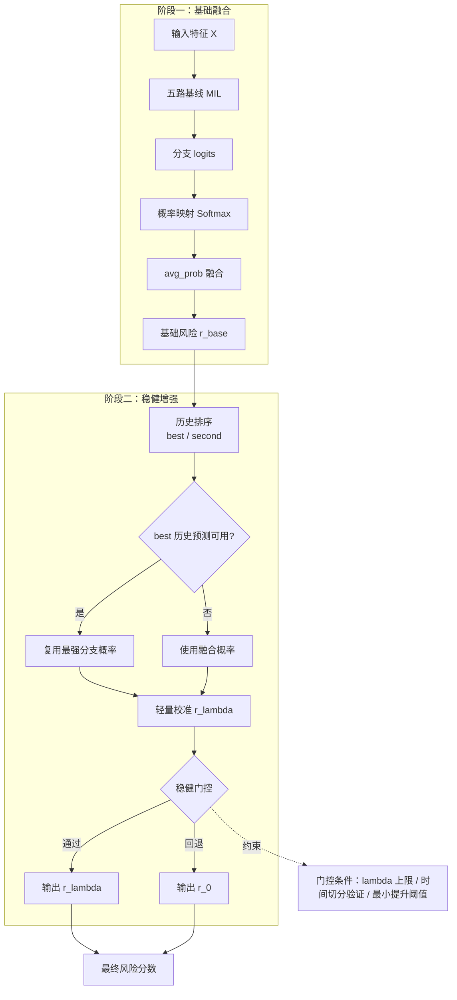

# EnsembleDecision：论文版精简图示（一页版）

> 用于方法章节直接粘贴：包含流程图与核心公式。  
> 适配当前线上实现（`avg_prob` + 最强模型蒸馏 + 轻量二次校准 + 稳健回退）。

---

## 1) 方法流程图（可直接粘贴）

---

## 2) 核心公式（论文可用）

### 2.1 决策级概率融合（主干）

设第 \(b\) 个基线分支输出 logits 为 \(\mathbf{z}_b \in \mathbb{R}^K\)，对应概率为
\[
\mathbf{p}_b=\mathrm{softmax}(\mathbf{z}_b).
\]

在活跃分支集合 \(\mathcal{B}\) 上，采用加权概率均值：
\[
\mathbf{p}_{\mathrm{fused}}=\sum_{b\in\mathcal{B}} w_b\,\mathbf{p}_b,\quad
w_b\ge 0,\ \sum_{b\in\mathcal{B}} w_b=1.
\]

其中 \(w_b\) 可来自显式权重、历史先验或等权策略（实现中支持自动 Top-2 强分支保留）。

### 2.2 风险分数定义

将离散生存区间类别索引记为 \(k\in\{0,\dots,K-1\}\)，则基础风险定义为期望等级：
\[
r_{\mathrm{base}}=\sum_{k=0}^{K-1} k\cdot p_{\mathrm{fused}}(k).
\]

### 2.3 轻量二次校准（排序微调）

在最强模型（best）与次强模型（second）风险上做符号微调：
\[
r_{\lambda}=r_{\mathrm{best}}+\lambda\cdot
\mathrm{sign}\!\left(r_{\mathrm{second}}-r_{\mathrm{best}}\right),
\quad \lambda\in[0,\lambda_{\max}].
\]

该项仅做微小排序打破，不重写主模型概率结构。

### 2.4 稳健回退门控

按预测时间切分 train/val 后，若
\[
\Delta_{\mathrm{val}}=
C_{\mathrm{val}}(r_{\lambda})-C_{\mathrm{val}}(r_{0})<\delta_{\min}
\]
或
\[
C_{\mathrm{all}}(r_{\lambda})<C_{\mathrm{all}}(r_{0}),
\]
则强制回退到 \(\lambda=0\)。

其中：

- \(C(\cdot)\)：C-index；
- \(r_0=r_{\mathrm{best}}\)（即不做二次校准）；
- \(\delta_{\min}\)：最小验证提升阈值；
- \(\lambda_{\max}\)：校准幅度上限。

---

## 3) 方法章节可直接粘贴文字（精简版）

本文采用决策级集成框架。首先对五个异构 MIL 基线模型进行并行前向，得到分支 logits，并在概率空间执行加权均值融合（`avg_prob`）以获得基础风险估计。随后，引入在线轻量二次校准：基于历史队列 C-index 动态识别最强与次强模型，并对最强模型风险施加符号微扰 \(r_{\lambda}=r_{best}+\lambda\cdot \mathrm{sign}(r_{second}-r_{best})\)，用于打破排序并列。为抑制偶然性，进一步采用“幅度上限 + 时间切分验证 + 最小提升阈值”三重稳健门控；当验证集提升不足或全量指标退化时自动回退至 \(\lambda=0\)。该设计在保持可解释性的同时提升了集成性能稳定性。

---

## 4) 图注建议（可选）

**图X.** EnsembleDecision 的一页式流程：以 `avg_prob` 为主干融合，在线叠加“最强模型蒸馏 + 次强模型符号微调”，并通过稳健门控（\(\lambda\) 上限、时间切分验证、阈值回退）抑制过拟合与指标波动。

