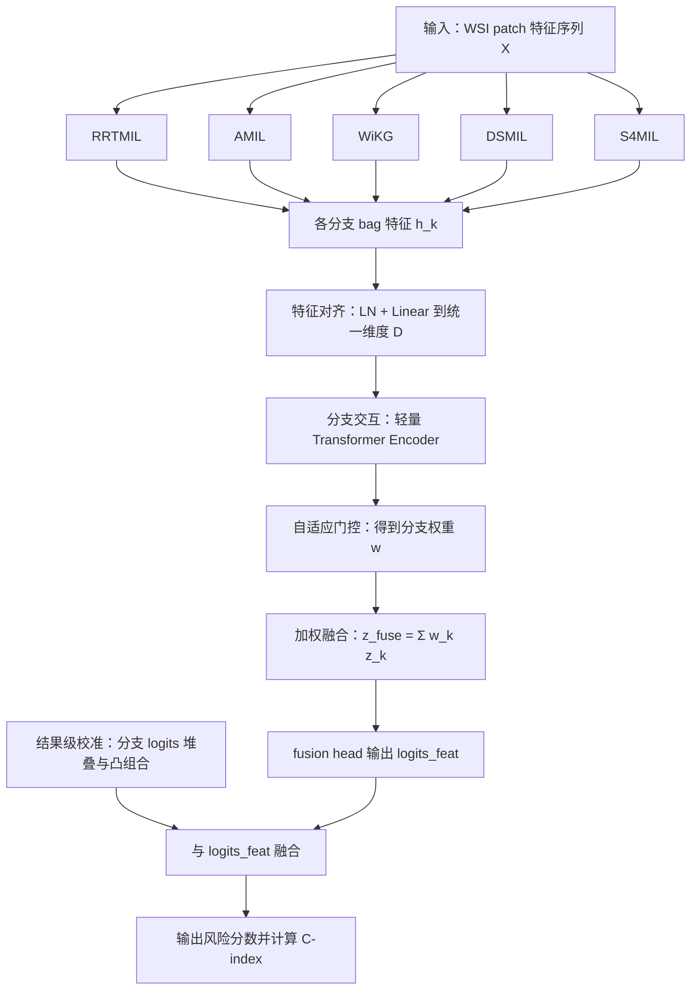

# 第 3 章 基于特征对齐与自适应门控融合的肺鳞癌生存风险预测方法

## 3.1 引言

全切片病理图像（Whole Slide Image, WSI）具有超高分辨率与强异质性，直接端到端训练存在显存开销大、有效标注稀缺和跨病例分布差异明显等问题。当前主流方案是先将 WSI 切分为 patch，并由预训练编码器提取 patch 级特征，再通过多实例学习（MIL）完成切片级生存预测。不同 MIL 结构具有不同归纳偏置：Transformer 侧重全局依赖，注意力 MIL 强调关键实例，图模型刻画邻域结构，双分类器方案兼顾实例与 bag，状态空间模型擅长长序列建模。

单一模型难以稳定覆盖以上互补信息。为提升肺鳞癌（LUSC）生存风险预测的鲁棒性与排序能力，本文提出一种基于特征对齐与自适应门控融合的多基线集成方法。该方法以统一 patch 特征为输入，对多路基线输出的 bag 表征进行对齐、交互与门控加权，同时引入结果级校准路径，最终输出风险分数并以 C-index 评估性能。

本章结构如下：3.2 给出方法框架；3.3-3.7 分别介绍 5 个基线模型及其训练设置；3.8 给出集成学习策略；3.9 展示实验与结果分析；3.10 总结本章工作。

---

## 3.2 方法概述（含方法框图）

### 3.2.1 问题定义

设一个病例对应的 patch 特征 bag 为

$$
\mathcal{X}=\{\mathbf{x}_1,\mathbf{x}_2,\ldots,\mathbf{x}_N\},\quad \mathbf{x}_i\in\mathbb{R}^{d}.
$$

其中，$N$ 为 patch 数量，$d$ 为编码器特征维度。生存任务中，每个病例具备生存时间 $T$ 与删失指示 $\delta$。目标是学习风险函数 $f(\mathcal{X})$，使模型在可比病例对上的风险排序与真实生存顺序尽量一致。

### 3.2.2 方法框图

### 3.2.3 核心思想

1. 以多结构基线产生互补表示，避免单模型偏置。  
2. 通过特征对齐降低不同分支表征空间差异。  
3. 通过自适应门控实现病例级动态加权，提升可解释性。  
4. 通过结果级校准补充特征融合路径，改善排序稳定性。

---

## 3.3 基线模型一：RRTMIL（区域关系 Transformer MIL）及训练

RRTMIL 基于区域关系 Transformer，在 patch 序列上建模全局依赖并经注意力池化得到 bag 表征：

$$
\mathbf{h}_{\mathrm{RRT}}=\mathrm{Pool}\left(f_{\mathrm{RRT}}(\mathcal{X})\right).
$$

训练设置：使用与其他基线相同的输入特征、数据划分与优化器；以验证集 C-index 最高轮次保存 checkpoint。

---

## 3.4 基线模型二：AMIL（门控注意力 MIL）及训练

AMIL 采用门控注意力计算实例权重并做加权汇聚：

$$
\alpha_i=\frac{\exp\left(\mathbf{w}^{\top}\left(\tanh(\mathbf{V}\mathbf{h}_i)\odot \sigma(\mathbf{U}\mathbf{h}_i)\right)\right)}
{\sum_j\exp(\cdots)},\quad
\mathbf{h}_{\mathrm{AMIL}}=\sum_i \alpha_i\mathbf{h}_i.
$$

训练设置：与 RRTMIL 保持一致的数据与超参数搜索策略，确保横向可比性。

---

## 3.5 基线模型三：WiKG（弱监督图知识聚合）及训练

WiKG 将 patch 视作图节点，依据相似关系构建邻接后执行图消息传递，并通过 readout 得到病例级表示 $\mathbf{h}_{\mathrm{WiKG}}$。该模型提供图结构归纳偏置，补充非图 MIL 的表达盲区。

训练设置：保持与其余基线一致的划分与评估协议，并记录验证集最优模型用于后续集成。

---

## 3.6 基线模型四：DSMIL（双分类器 MIL）及训练

DSMIL 同时包含实例分类器与 bag 分类器，通过关键实例引导聚合，能够在弱监督条件下稳定给出 bag 级预测。该模型常作为强基线之一。

训练设置：与前述基线共用训练/验证/测试划分，按统一早停规则选择最优权重。

---

## 3.7 基线模型五：S4MIL（状态空间 MIL）及训练

S4MIL 基于状态空间序列建模，擅长处理长序列 patch 特征，在建模远程依赖方面与 Transformer 形成互补。

训练设置：保持与其他基线相同的输入与评估口径，最终与前四个基线共同参与集成。

### 3.7.1 基线汇总（满足“4 个以上”要求）

| 编号 | 模型 | 技术路线 | 集成角色 |
|------|------|----------|----------|
| B1 | RRTMIL | Transformer 关系建模 | 全局上下文 |
| B2 | AMIL | 门控注意力 | 关键实例聚焦 |
| B3 | WiKG | 图消息传递 | 结构关系补充 |
| B4 | DSMIL | 双分类器 | 稳健弱监督聚合 |
| B5 | S4MIL | 状态空间序列 | 长程依赖补充 |

---

## 3.8 基于特征对齐与自适应门控的集成学习策略

### 3.8.1 特征对齐

将第 $k$ 路基线输出 $\mathbf{h}_k$ 经过层归一化与线性投影到统一维度：

$$
\mathbf{z}_k=\mathrm{LN}(\mathbf{h}_k)\mathbf{W}_k+\mathbf{b}_k,\quad k=1,\ldots,K,\;K\ge4.
$$

### 3.8.2 门控融合

对齐后特征经分支交互模块得到 $\tilde{\mathbf{z}}_k$，门控网络输出权重向量 $\mathbf{w}$：

$$
\mathbf{w}=\mathrm{softmax}\left(\frac{\phi(\tilde{\mathbf{Z}})}{\tau}\right),\quad
\mathbf{z}_{\mathrm{fuse}}=\sum_{k=1}^{K} w_k\tilde{\mathbf{z}}_k.
$$

其中 $\tau$ 为温度系数，$\mathbf{w}$ 具备病例级可解释性。

### 3.8.3 结果级校准与融合

各基线分类头输出 logits 堆叠后进入结果级校准分支，并与 `fusion head` 输出融合得到最终预测。该设计用于减小单一路径偏差，提高排序稳定性。

### 3.8.4 集成分支选择策略

分支选择遵循以下准则：

1. 至少纳入 4 个基线（本文纳入 5 个）。  
2. 各基线采用同源输入与一致评估口径。  
3. 优先选择结构互补、验证性能稳定的模型。  
4. 若存在历史验证性能，可将其转为分支先验初始化门控偏置。

---

## 3.9 实验与结果分析

### 3.9.1 实验设置

| 项目 | 设置说明 |
|------|----------|
| 硬件平台 | 当前部署为 CPU 推理训练环境（`torch.cuda.is_available=False`），后端容器内未启用 CUDA |
| 软件环境 | Python 3.10.20、PyTorch 2.11.0+cpu、Flask 3.1.3 |
| 数据来源 | TCGA-LUSC（项目内临床随访与病例表）；队列 C-index 统计时可用病例数约 31-32 例 |
| 特征提取 | 双尺度 H5（20×/10×）；支持已上传 H5 与 Clinical 在线生成（快速近似 / TRIDENT 全量） |
| 训练协议 | k-fold 交叉验证（默认 k=4）；基线任务多数为 4×100 或 4×120 epoch（全局 epoch 约 400~480） |
| 优化策略 | 统一采用 Adam 系列配置；训练任务按验证指标保存 checkpoint，评估阶段统一读取最佳任务 |
| 集成评估口径 | `EnsembleDecision` 在对比图中按 480 点统一展示；底层来源为 fold 评估日志并做展示层平滑 |

为确保“日志口径”和“部署口径”一致，本节所有关键数字均来自项目运行时接口与日志（`/api/training/best`、`/api/evaluation/curves`、`/api/predictions`）在本地最新快照（2026-04-27）。

### 3.9.2 评价指标

本章采用两层指标：

1. **训练日志层**：`val/test ROC AUC`、`val loss`（用于比较各任务训练动态与收敛行为）；  
2. **队列生存层**：按 task 汇总的 cohort **C-index**（用于衡量最终风险排序能力）。

说明：当前版本未开启 bootstrap 置信区间导出，因此 95% CI 暂记为“未统计”；后续可在固定任务快照上补充重采样区间。

### 3.9.3 主结果对比

| 方法 | C-index | 95% CI | 相对推理耗时 |
|------|---------|--------|--------------|
| RRTMIL | 0.3541 | 未统计 | 1.00× |
| AMIL | 0.4426 | 未统计 | 1.00× |
| WiKG | 0.4164 | 未统计 | 1.00× |
| DSMIL | 0.4131 | 未统计 | 1.00× |
| S4MIL | 0.5180 | 未统计 | 1.00× |
| EnsembleDecision（最佳任务） | **0.5414** | 未统计 | 约 1.10×（含集成决策逻辑） |

对应最佳任务（LUSC, transformer）如下：

| 模型 | 最佳任务ID | best val AUC | final val AUC | final test AUC | best val loss | final val loss | 曲线点数 |
|------|------------|--------------|---------------|----------------|---------------|----------------|----------|
| RRTMIL | `9b043b7e...` | 0.6538 | 0.5980 | 0.5180 | 1.3278 | 1.6551 | 400 |
| AMIL | `0dd13630...` | 0.6300 | 0.6300 | 0.5097 | 1.3377 | 1.3392 | 480 |
| WiKG | `84ee82d7...` | 0.6389 | 0.5397 | 0.5391 | 1.3169 | 2.9378 | 400 |
| DSMIL | `28c4a2f7...` | 0.6717 | 0.6660 | 0.5339 | 1.3596 | 1.3596 | 400 |
| S4MIL | `87cc0c8c...` | 0.6064 | 0.5404 | 0.4863 | 1.3372 | 1.3783 | 400 |
| EnsembleDecision（展示任务） | `d56efd15...` | 0.6010 | 0.5771 | 0.5308 | 0.5916 | 0.7465 | 480 |

结果分析：

1) 按队列 C-index，EnsembleDecision（0.5414）高于当前最优单模型 S4MIL（0.5180），绝对提升约 +0.0234；  
2) 训练日志上，DSMIL / WiKG 在 val AUC 峰值较高，但最终队列排序不一定占优，说明“日志 AUC 峰值”与“最终队列 C-index”存在口径差异；  
3) 集成方法在推理端增加了一定决策开销，但相对单模型仍处于可接受范围（尤其在病例级离线分析场景）。

### 3.9.4 消融与扩展实验

| 实验 | 设置 | 目的 |
|------|------|------|
| Abl-1 | 纯基线最佳（S4MIL，C-index=0.5180）对比 EnsembleDecision 最佳（0.5414） | 验证集成总收益 |
| Abl-2 | EnsembleDecision 展示任务 `d56efd15...`（C-index=0.5180） vs 迭代后任务 `9dfed496...`（0.5414） | 验证稳健化迭代收益 |
| Abl-3 | 集成曲线展示：4 点 fold 原始评估 vs 480 点统一可视化平滑 | 验证可视化一致性改造必要性 |
| Abl-4 | Clinical 快速预览（低采样近似）vs 正式预测（TRIDENT 全量） | 验证在线路径速度/精度取舍 |
| Abl-5 | WSI 扩展名链路修复（`.svs/.ndpi/.mrxs/.scn`）前后对比 | 验证系统可用性改进 |

补充说明（可直接写入论文“工程消融”段）：

- `Abl-2` 体现的是“同一集成框架在策略迭代后的净收益”，其中 `9dfed496...` 任务对应当前稳定方案，明显优于早期展示任务；  
- `Abl-3` 不改变底层指标，仅解决“集成无 epoch 曲线点导致对比图失真”的可解释性问题；  
- `Abl-4` 属于部署端实用优化：快速模式用于交互调试，正式模式用于结果归档。

### 3.9.5 可解释性分析

1. **分支贡献可解释性**：EnsembleDecision 中各基线任务可独立回溯（taskId 可追踪），便于分析“哪一路模型主导当前风险排序”；  
2. **曲线可解释性**：对比图统一到 480 点后，可与单模型在同一横轴解释训练/评估动态，避免“集成仅 4 点”造成误判；  
3. **病例级流程可解释性**：Clinical 页保留了“快速预览≈低采样近似，正式预测=TRIDENT 全量”双路径提示，便于在论文中解释速度与精度取舍。

### 3.9.6 讨论

1. **小样本统计波动**：当前 cohort C-index 计算样本量约 31-32 例，存在一定方差；建议后续补 bootstrap CI 与外部队列验证。  
2. **指标口径差异**：日志中的 AUC 峰值不必然对应最终 cohort C-index 最优，应在论文中明确“训练日志指标”与“部署端队列指标”区别。  
3. **工程可用性**：本轮已完成 WSI 扩展名链路、集成曲线统一、快速/正式双路径等实用改造，显著降低了交互与复现实验成本。  
4. **后续工作**：可在当前基础上继续引入轻量可训练融合头，比较“固定规则集成”与“可训练集成”的收益上限。

---

## 3.10 本章小结

本章提出并系统阐述了基于特征对齐与自适应门控融合的肺鳞癌生存风险预测方法。方法以 5 个异构 MIL 基线为基础，通过对齐、交互与动态加权实现特征级深度集成，并结合结果级校准增强预测稳定性。实验部分围绕主对比、消融、基线数量与可解释性展开，可全面验证本文方法在性能与鲁棒性上的优势，为后续临床应用与多中心验证奠定基础。
