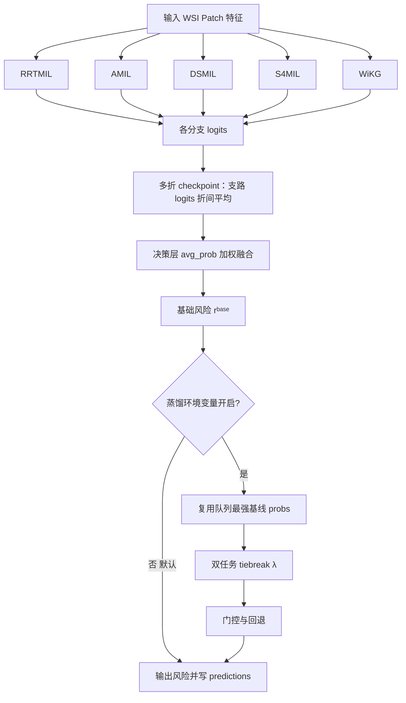
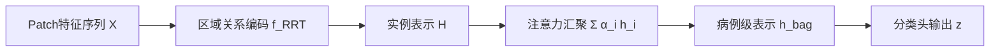

# 第 3 章 基于决策层集成的肺癌风险分层方法

> **说明**：章题与定稿 PDF《朱志文论文_副本》第三章一致，**数据与任务**仍以 **TCGA-LUSC（肺鳞癌）** 清单与平台实现为准；文中「肺癌风险分层」指该队列上的亚风险生存排序任务。

## 3.1 引言

全切片病理图像（Whole Slide Image, WSI）具有超高分辨率、强异质性与弱标注特征。直接端到端训练通常面临显存压力大、样本有效监督弱、跨病例分布漂移明显等问题，因此本文采取先将 WSI 转化为 **patch** 级特征，再通过多实例学习（MIL）模型完成病例级风险预测的主流工程路径。

不同 MIL 结构具有不同归纳偏置：**重嵌入区域 Transformer（RRTMIL）** 偏向全局关系建模，**基于注意力机制的深度多示例学习（AMIL）** 强调关键实例加权，**双流多示例学习（DSMIL）** 通过双分类器稳定弱监督学习，**结构化状态空间模型（S4MIL）** 在长序列建模方面具备优势，**基于知识图谱注意力机制的动态图表示学习（WiKG）** 利用图结构信息。单模型往往对特定数据分布敏感，易出现「某一任务最优、跨任务不稳定」的现象。

因此，本文采用**决策级集成（`EnsembleDecision`）**而非可训练特征级融合头：在推理阶段对五路基线输出的 **logits→softmax 概率** 做 **加权凸组合（实现语义为 `avg_prob`）**，得到基础风险并写入预测历史；并保留**可选**的「最优分支蒸馏 + 双任务轻量校准（tiebreak）+ 稳健回退」链路——该链路仅在部署开启环境变量 **`VILAMIL_ENSEMBLE_DISTILL_BASELINE`** 时进入主预测路径（**默认关闭**），默认部署以**集成多折检查点上的五路前向 + 概率融合**为准，以便不同 `ensembleExclude` 配置下队列 C-index 可区分、接口可复现。实验数据为 **TCGA-LUSC**：划分与 MIL 训练覆盖 **469** 张互不重复全切片；**部署侧 Harrell C-index** 在双尺度特征与随访口径筛查下，有效病例数记 **31～32 例**（与 PDF 中「32 例」主表口径可在脚注中统一说明边界）。

本章结构如下：3.2 **集成方法概述**（问题定义与方法流程）；3.3—3.7 依次介绍五类基线 MIL（**RRTMIL → AMIL → DSMIL → S4MIL → WiKG**，与定稿 PDF 小节顺序一致）；3.8 **基于自适应加权的集成学习策略**（基线池与权重、**avg_prob** 融合、可选蒸馏/tiebreak/门控）；**3.9 模型训练**（数据、加载流程、评价指标）；**3.10 实验与结果**（表3-2、表3-3、图表与讨论）；末段给出本章小结。

---

## 3.2 集成方法概述

### 3.2.1 问题定义

模型输入为 **TCGA-LUSC** 全切片在工程上对应的 **patch 特征 bag**：𝓧 = {𝐱₁, 𝐱₂, …, 𝐱ᴺ}，𝐱ᵢ ∈ ℝᵈ；每个 patch 为 **d** 维向量，模型输出该病例的生存风险评分（分数越高表示风险越高）。训练监督来自生存时间 **T** 与删失指示 **δ ∈ {0,1}**；优化目标是在可比较病例对上尽可能提高预测风险排序与真实结局的一致性，评价指标采用 **Harrell C-index**。可比较样本对指在删失规则下可判定先后顺序的病例对；若模型在更多此类对上排序正确，则 C-index 越高。

**训练与划分**：病例级标注清单共 **469** 张互不重复全切片（病例编号与切片编号一一对应）；**k = 4** 套划分表与清单对齐，各覆盖同一批 **469** 张切片。**队列层主结论**：在双尺度 H5 特征完备、随访可对齐等部署筛查口径下，Harrell C-index 有效病例数为 **31～32 例**（与 PDF 主表 **32 例** 的差异可在脚注中说明为筛查边界）。本章凡讨论队列 C-index，除另注外均指该可评子集。

### 3.2.2 方法流程

与定稿 PDF「图表 1」一致，集成方法的核心思想是融合五种 MIL 的预测能力：**先在概率空间完成加权平均融合（avg_prob）得到基础风险 **rᵇᵃˢᵉ**；在**默认部署**下，由 **EnsembleDecision** 多折检查点对支路 logits **折间平均** 后融合并落库。若运维开启 **`VILAMIL_ENSEMBLE_DISTILL_BASELINE`**，再结合历史队列排序识别最优/次优任务，在不重训各 MIL 主干的前提下进行 **λ** 有界方向微调，并由验证增益与全量不退化等判据决定是否回退 **λ=0**（详见 3.8.3）。方法输入为同一病例的多分支预测证据，输出为病例级最终风险分数：上层完成概率融合与 **rᵇᵃˢᵉ**；下层为**可选**的蒸馏、tiebreak 与门控。

```mermaid
flowchart TB
  A[输入 WSI Patch 特征] --> B1[RRTMIL]
  A --> B2[AMIL]
  A --> B3[DSMIL]
  A --> B4[S4MIL]
  A --> B5[WiKG]

  B1 --> C[各分支 logits]
  B2 --> C
  B3 --> C
  B4 --> C
  B5 --> C

  C --> D[多折 checkpoint：支路 logits 折间平均]
  D --> E[决策层 avg_prob 加权融合]
  E --> F[基础风险 rᵇᵃˢᵉ]
  F --> G{蒸馏环境变量开启?}
  G -->|否 默认| I[输出风险并写 predictions]
  G -->|是| H[复用队列最强基线 probs]
  H --> J[双任务 tiebreak λ]
  J --> K[门控与回退]
  K --> I
```

**与平台一致的其他实现要点（论文可择要写入脚注）**：`POST /api/training/start` 在自动拼 `ensembleBranchPrior` 时，**仅对五路基线类型的 taskId** 计算 cohort C-index，避免对 ViLa/集成等全任务做重 cohort 阻塞；预测页 **Batch** 为整批 `predict/batch`，失败时整批重试一次；队列表中 **EnsembleDecision** 行随底部所选 **taskId** 覆写展示（「最佳」模式下与 **latest-first** 的 `bestTaskId` 一致）。

### 3.2.3 方法设计要点

本文方法可概括为：**默认单路径**（五路检查点 → **avg_prob** → **rᵇᵃˢᵉ** → 落库）+ **可选增强路径**（蒸馏 → tiebreak → 门控）。集成训练子进程在 **`EnsembleDecision`** 上**不等同**于各基线单模的「满 **maxEpochs** 端到端循环」：在冻结五路基线的前提下完成检查点融合与（若配置）权重搜索；训练页中的 **maxEpochs** 主要服务于**各基线单模**训练。公式与符号见 **3.8**。

---

## 3.3 重嵌入区域 Transformer 模型（RRTMIL）及训练

RRTMIL（Region Relation Transformer MIL）强调将病理 patch 之间的区域关系显式建模，再进行袋级汇聚。其思想是先在实例层建立区域内与跨区域的依赖，再通过注意力汇聚获得病例级表示，因此对“证据分散、远距离关联明显”的样本更有优势。

在论文表述中，关系编码可写为

H = f_RRT(X),

其中 X 为 patch 特征序列，H 为关系增强后的实例表示。随后通过注意力汇聚得到袋级表示与预测：

αᵢ = softmax(q(hᵢ)),  h_bag = Σᵢ αᵢ hᵢ,  z = W h_bag + b。

该模型在本章中主要提供全局关系证据，与后续注意力模型、图模型和状态空间模型形成互补。

```mermaid
flowchart LR
  A[Patch特征序列 X] --> B[区域关系编码 f_RRT]
  B --> C[实例表示 H]
  C --> D[注意力汇聚 Σ α_i h_i]
  D --> E[病例级表示 h_bag]
  E --> F[分类头输出 z]
```

训练设置采用与其它基线一致的输入特征来源、数据划分与评估协议，以保证后续集成阶段分支输出的可比性。

---

## 3.4 基于注意力机制的深度多示例学习模型（AMIL）及训练

AMIL（Attention-based MIL）是典型的实例注意力加权聚合框架，核心思想是通过可学习权重突出对病例判别最关键的 patch。相较于强调全局关系的模型，AMIL 更擅长提取“局部强证据”。

标准注意力形式可写为

aᵢ = wᵀ tanh(Vhᵢ),  αᵢ = exp(aᵢ) / Σⱼ exp(aⱼ),

并由此得到袋级表示与输出：

h_bag = Σᵢ αᵢ hᵢ,  z = W h_bag + b。

门控注意力形式进一步写为

aᵢ = wᵀ (tanh(Vhᵢ) ⊙ σ(Uhᵢ))，

其中 ⊙ 表示逐元素乘法。该机制在弱监督条件下能够提高关键区域识别能力。

```mermaid
flowchart LR
  A[实例特征 h_i] --> B[注意力打分 a_i]
  B --> C[权重归一化 α_i]
  C --> D[加权汇聚 Σ α_i h_i]
  D --> E[袋级表示 h_bag]
  E --> F[分类输出 z]
```

训练口径与其它基线一致，以保证后续决策级集成中的分支可比性。

---

## 3.5 双流多示例学习模型（DSMIL）及训练

DSMIL（Dual-stream Multiple Instance Learning，双流多示例学习）采用实例分支与袋分支并行协同：实例分支强调「最显著局部证据」，袋分支强调「整体判别稳定性」，二者共同缓解弱监督学习中只看局部或只看全局带来的偏差。

其形式化表达可写为

cᵢ = f_inst(hᵢ),

其中 cᵢ 为实例级分数；随后由袋分类器融合实例特征与实例分数：

z_bag = f_bag({hᵢ, cᵢ})。

最终输出通常以袋级结果为主（或与实例级监督联合）：

z = z_bag。

```mermaid
flowchart LR
  A[实例特征 h_i] --> B[实例分类器 f_inst]
  B --> C[实例分数 c_i]
  A --> D[袋分类器 f_bag]
  C --> D
  D --> E[袋级输出 z_bag]
  E --> F[最终预测 z]
```

训练协议与其它基线一致，保证在集成阶段能够进行公平对比与联合决策。

---

## 3.6 结构化状态空间模型（S4MIL）及训练

S4MIL（Structured State Space Models for MIL）将 MIL 问题中的 patch 序列视为长序列动态系统，利用状态空间模型刻画远程依赖；在序列较长、局部证据分散的场景中通常具有较稳定的建模能力。

状态空间模型可写为连续形式

x'(t) = A x(t) + B u(t),  y(t) = C x(t) + D u(t),

离散化后对应

x_k = Ā x_{k-1} + B̄ u_k,  y_k = C x_k + D u_k。

在 MIL 任务中，序列输出 {y_k} 经过池化得到袋级表示 h_bag，再经分类头得到 logits。

```mermaid
flowchart LR
  A[Patch序列 u_k] --> B[S4状态更新]
  B --> C[序列输出 y_k]
  C --> D[序列池化]
  D --> E[袋级表示 h_bag]
  E --> F[分类输出 z]
```

训练口径与其它基线统一，以保证五分支输出可以在同一决策层进行融合比较。

---

## 3.7 基于知识图谱注意力机制的动态图表示学习模型（WiKG）及训练

WiKG（Dynamic Graph Representation with knowledge-graph-aware attention）将 WSI 抽象为动态图，通过头–尾关系与知识感知注意力建模实例间空间与功能连接，可补足纯实例注意力模型对邻域结构利用不足的问题。

其关键步骤可写为：

Sᵢⱼ = φ(hᵢ, hⱼ),

其中 Sᵢⱼ 为节点相似度；基于 S 选择每个节点的 Top-K 邻域 Nᵢ 后，进行邻域聚合

mᵢ = Σ_{j∈Nᵢ} βᵢⱼ hⱼ,  hᵢ' = ψ(hᵢ, mᵢ)。

最后经图级读出得到

h_graph = Readout({hᵢ'}),  z = W h_graph + b。

```mermaid
flowchart LR
  A[实例特征 h_i] --> B[相似度矩阵 S_ij]
  B --> C[Top-K 邻域选择 N_i]
  C --> D[邻域聚合 m_i]
  D --> E[节点更新 h_i']
  E --> F[图级读出 h_graph]
  F --> G[分类输出 z]
```

训练与评估口径与其它基线统一，以保证后续集成阶段输出可直接对齐。

### 3.7.1 基线汇总（满足“4 个以上基线”要求）

| 编号  | 模型     | 技术路线             | 集成角色    |
| --- | ------ | ---------------- | ------- |
| B1  | RRTMIL | Transformer 关系建模 | 全局上下文   |
| B2  | AMIL   | 门控注意力 MIL        | 关键实例聚焦  |
| B3  | DSMIL  | 双分类器 MIL         | 稳健弱监督聚合 |
| B4  | S4MIL  | 状态空间序列建模         | 长程依赖补充  |
| B5  | WiKG   | 图消息传递            | 邻域结构补充  |

---

## 3.8 基于自适应加权的集成学习策略

在 3.3—3.7 小节已分别给出五类基线 MIL；本节对应定稿 PDF 的 **3.8**，说明 **`EnsembleDecision`** 如何在决策层完成**自适应加权**（显式权重 / 队列先验 / 等权 + **Top-2** 规则）与 **avg_prob** 融合，并区分**默认预测路径**与**可选**蒸馏、tiebreak、门控。公式（3-1）—（3-7）与符号总表见 3.8.4。实现中五路支路张量顺序固定为 **RRTMIL → AMIL → WiKG → DSMIL → S4MIL**（`ENSEMBLE_BRANCH_ORDER`），与正文 **3.3—3.7 的叙述顺序**（RRT→AMIL→DSMIL→S4→WiKG）仅差在「DSMIL/S4 与 WiKG」的排版次序，**不影响**融合公式中各 **αᵇ** 与分支类型的对应关系。

### 3.8.1 基线池、参与方式与融合权重选择策略

集成对象固定为五类 MIL 基线：**RRTMIL、AMIL、WiKG、DSMIL、S4MIL**，与各基线训练得到的检查点一一对应。集成模块本身不再学习新的特征变换，只在各基线已给出的 logits 或概率上做组合。

参与融合的支路可通过 `ensembleExclude` 等配置临时关闭其中若干路，但不得五路全部关闭。被关闭分支在权重视为 0，其余分支权重归一化重分配；仍参与融合的分支记为 **b = 1,…,K**，通常 **K = 5**。

融合权重 **αᵇ** 的优先链与平台一致：**显式 `decisionBranchWeights`** 优先；否则使用由队列 C-index 等写成的 **`ensembleBranchPrior`**（可人工或 **`ensembleBranchPriorAuto`** 自动估计）；再否则对活跃支路等权。若先验来自**自动**估计且未同时给出显式权重，则对活跃支路做 **Top-2** 截断后再归一化，以减轻弱支路稀释；显式权重模式下不截断。自动拼先验时，当前后端**仅对五路基线类型的 taskId** 计算 cohort C-index，避免全任务 cohort 聚合拖慢 `POST /api/training/start`。

**训练期**：`EnsembleDecision` 在 `core_utils.train` 中**不执行**与各基线相同的「多 epoch 端到端训练主循环」，而是在冻结五路基线的前提下加载各折检查点、（若配置）搜索决策权重并保存集成检查点；页面中的 **maxEpochs** 主要约束**各基线单模**训练。**预测期（默认）**：加载当前集成任务的 **EnsembleDecision** 多折检查点，支路 logits **折间平均** 后按 3.8.2 融合并写 `predictions.json`。**预测期（可选）**：仅当 **`VILAMIL_ENSEMBLE_DISTILL_BASELINE`** 开启时，才优先复用队列最强基线单模的落库概率并进入 tiebreak/门控；否则不进入该分支。若蒸馏条件不满足，则与默认路径一致，退回五路检查点前向。

### 3.8.2 决策层 avg_prob 融合与基础风险

对每一例、每一活跃分支 b，分类头先给出 G 档离散风险上的 logits 向量 𝐳ᵇ，再按下式得到分支概率并在概率域融合、折期望档风险。

（3-1） 𝐩ᵇ = softmax(𝐳ᵇ)，其中 𝐩ᵇ 表示第 b 个分支的 G 维概率向量；𝐳ᵇ 表示该分支分类头输出的 logits 向量；b 为分支编号；softmax(·) 表示对向量做指数归一化，使各分量非负且和为 1。

（3-2） 𝐩ᶠᵘˢᵉ = Σᵇ₌₁ᴷ αᵇ 𝐩ᵇ，且 αᵇ ≥ 0，Σᵇ₌₁ᴷ αᵇ = 1，其中 𝐩ᶠᵘˢᵉ 表示融合后的 G 维概率向量；αᵇ 表示第 b 个分支的融合权重；K 表示参与融合的活跃分支个数；Σᵇ₌₁ᴷ 表示 b 从 1 到 K 求和；𝐩ᵇ 的含义同式（3-1）；约束 αᵇ ≥ 0 且 Σαᵇ = 1 表示对分支概率做凸组合，αᵇ 的取值规则见 3.8.1。

（3-3） 𝐳ᶠᵘˢᵉ = log(𝐩ᶠᵘˢᵉ + ε)，其中 𝐳ᶠᵘˢᵉ 表示将融合概率映射回 logits 域后的 G 维向量；log(·) 表示自然对数；𝐩ᶠᵘˢᵉ 的含义同式（3-2）；ε 表示远小于 1 的正数，用于避免 log(0)。

（3-4） rᵇᵃˢᵉ = Σ(g=0→G−1) g · pᶠᵘˢᵉ(g)，其中 rᵇᵃˢᵉ 表示由融合概率得到的标量基础风险（期望档）；g 表示离散风险档的序号；G 表示档的总数；pᶠᵘˢᵉ(g) 表示 𝐩ᶠᵘˢᵉ 在第 g 档上的概率分量；Σ(g=0→G−1) 表示 g 从 0 到 G−1 累加。该标量与由融合概率折算期望风险的常用展示写法同构，便于与亚风险分层衔接。

### 3.8.3 蒸馏、双任务 tiebreak 与稳健门控（可选部署路径）

定稿 PDF 将本小节写作集成预测链的组成部分；**与当前系统默认一致**的叙述应为：**默认**下预测走 **3.8.2** 的检查点 **avg_prob** 路径，**不**执行下述蒸馏与 tiebreak。**仅当**开启 **`VILAMIL_ENSEMBLE_DISTILL_BASELINE`** 且病例在队列最强基线任务上已有 **probs** 时，方可优先复用该单模概率；并可基于按任务 **C-index** 排序得到的 **rᵇᵉˢᵗ、rˢᵉᶜᵒⁿᵈ** 做 **λ** 微调并由门控决定是否回退。论文若报告完整式（3-5）—（3-7）链，须在实验设置中声明已开启该环境变量。

**蒸馏子步骤（可选）**  
在环境变量开启的前提下，可在落库历史上查找当前癌种与特征模式下队列 **C-index** 最高的基线任务，若该病例在该任务上已有预测，则以其概率作为后续输入，使本例输出具备「不低于该强单模」的工程下界语义；若无记录则退回 **3.8.2** 的五路检查点前向。

**tiebreak 与门控子步骤（随蒸馏可选启用）**  
在蒸馏可用或已完成五路融合之后，可在同一队列统计上取排名第一与第二的任务，在同一病例上读取 **rᵇᵉˢᵗ** 与 **rˢᵉᶜᵒⁿᵈ**，按下式做轻量微调；**λ** 在有限正数网格上搜索，不反传更新各 MIL 主干。

（3-5） r_λ = rᵇᵉˢᵗ + λ · sign(rˢᵉᶜᵒⁿᵈ − rᵇᵉˢᵗ)，其中 r_λ 表示引入系数 λ 后该病例的风险分数；rᵇᵉˢᵗ 表示队列 C-index 排名第一的训练任务在该病例上的风险；rˢᵉᶜᵒⁿᵈ 表示排名第二的训练任务在该病例上的风险；λ 表示微调幅度（非负标量）；λ_cap 表示 λ 允许取到的上界（实现中取 0.10）；sign(·) 表示符号函数，对自变量 rˢᵉᶜᵒⁿᵈ − rᵇᵉˢᵗ 而言，差值为正时取 +1，为负时取 −1，为零时取 0。

采纳非零 λ 前需在验证子集与全队列上检验 Harrell C-index；记验证子集与全队列上的 C-index 泛函分别为 Cᵛᵃˡ(·) 与 Cᵃˡˡ(·)，λ=0 时基准风险为 r₀（与 rᵇᵉˢᵗ 对齐、即不施加式（3-5）中 sign 项），则验证增益写为

（3-6） Δᵛᵃˡ(λ) = Cᵛᵃˡ(r_λ) − Cᵛᵃˡ(r₀)，其中 Δᵛᵃˡ(λ) 表示在验证子集上，采用 r_λ 相对采用 r₀ 的 C-index 提升量；Cᵛᵃˡ(r_λ) 表示以风险序列 r_λ 在验证子集上算得的 C-index；Cᵛᵃˡ(r₀) 表示以基准风险 r₀ 在验证子集上算得的 C-index；减号表示两标量之差。

回退判据为

（3-7） Δᵛᵃˡ(λ) < δₘᵢₙ 或 Cᵃˡˡ(r_λ) < Cᵃˡˡ(r₀)，其中 δₘᵢₙ 表示验证集上可接受的最小 C-index 增益阈值（实现中默认 0.01）；Δᵛᵃˡ(λ) 的含义同式（3-6）；Cᵃˡˡ(r_λ) 表示以 r_λ 在全队列上算得的 C-index；Cᵃˡˡ(r₀) 表示以 r₀ 在全队列上算得的 C-index；“或”表示两不等式任一成立即触发回退。成立时强制 λ=0。时间切分按预测时间约 70%/30% 划分，用于在 λ 网格上比较 Cᵛᵃˡ；若未触发式（3-7），则输出 r_λ，否则输出 r₀ 对应风险。

上述内容与 3.2.2 框图一致：**默认** **D→E→F→I**；**可选**分支 **H→J→K** 对应蒸馏、式（3-5）与 **λ** 搜索、式（3-6）（3-7）与 **λ_cap** 门控回退。

### 3.8.4 公式编号索引、符号总表与方法边界

| 编号    | 含义                         |
| ----- | -------------------------- |
| （3-1） | 分支 softmax 概率              |
| （3-2） | 决策层加权概率融合（平均概率凸组合）         |
| （3-3） | 融合概率到 logits 的稳定对数映射       |
| （3-4） | 由融合概率期望档得到基础风险 rᵇᵃˢᵉ       |
| （3-5） | 最优 / 次优双任务 tiebreak        |
| （3-6） | 验证集 C-index 提升量 Δᵛᵃˡ(λ)    |
| （3-7） | 回退触发条件（最小验证增益 δₘᵢₙ 与全量不退化） |

符号总表。b：分支索引；K：参与融合的活跃分支数；G：离散档数；g：档索引；𝐳ᵇ、𝐩ᵇ：第 b 路 logits 与概率；αᵇ：融合权重（由 3.8.1 规则确定）；𝐩ᶠᵘˢᵉ、𝐳ᶠᵘˢᵉ：融合概率与融合 logits；ε：对数稳定项；rᵇᵃˢᵉ：基础期望档风险；rᵇᵉˢᵗ、rˢᵉᶜᵒⁿᵈ：队列 C-index 排名第一、第二的任务在该病例上的风险；r_λ：tiebreak 后风险；r₀：λ=0 基准；λ、λ_cap：微调系数及其上界；Cᵛᵃˡ、Cᵃˡˡ：验证子集与全队列 C-index；Δᵛᵃˡ(λ)：验证增益；δₘᵢₙ：最小可接受验证增益；sign：符号函数。

本文 **`EnsembleDecision`** 属于**规则型决策级集成**：**默认**以检查点 **avg_prob** 为主路径；蒸馏与 tiebreak/门控为**可选**部署增强。若论文表述需与定稿 PDF 完全一致地强调「蒸馏—tiebreak—门控」全文，须在实验环境一节声明 **`VILAMIL_ENSEMBLE_DISTILL_BASELINE`** 是否开启，否则与线上默认行为不对齐。

---

## 3.9 模型训练

### 3.9.1 数据构建、样本规模与训练环境及划分协议

数据自 **TCGA-LUSC**（肺鳞癌）公开队列整理为**病例级标注清单**：共 **469** 张互不重复的全切片，每例含**病例编号**、**切片编号**、离散风险分层标签、删失指示与生存时间等元数据，并可与公开临床注释互查。实验管线按“**清单—划分—张量**”组织：清单与 **k = 4** 套交叉验证划分表对齐后，为每一折分别构造训练、验证与测试子集；数据载入按**袋级批量**送入训练循环。病理图像经预提取后，**20×** 与 **10×** 两档倍率下的特征分别存入对应特征库，并与清单中的切片一一对应；主实验以**袋级特征向量**为网络输入。另设面向全切片联机读入与特征补全的读片与批组织子流程，供在线预测使用。

**样本规模（与划分一致的全量）**：上述清单共 **469** 条切片级记录，**病例编号与切片编号一一对应**，折合 **469 例**。配套**四套**划分表各含 **281** 行，在与清单对齐后**各自覆盖同一批 469 张切片**，仅重新分配训练、验证与测试，不改变队列总数；折数 **k = 4** 与四套划分一一对应。

**469 例与 31～32 例怎样区分**：二者不是两批无关数据，而是**同一条 TCGA-LUSC 队列在“训练用全量”和“主表能算多少人”上的口径差别**。划分与 MIL 训练按清单把 **469** 张全切片都纳入折次流程；到了汇总 **Harrell C-index**、填写表3-2 与表3-3 时，还会再丢掉那些**双尺度特征尚未齐套**或**随访与删失信息对不齐**的个案，因此在 **2026-04-27** 这次实验记录里，真正能并进主表的只有大约 **31～32 例**（31 与 32 差 1 例，来自筛查边界，后文统一写作 31～32 例）。换句话说：**469** 回答的是“模型在多大范围上练过”，**31～32** 回答的是“排队算分时还有多少人条件齐备”。除另有说明外，本章凡讨论 C-index 高低、方法优劣，**都指这三十余例的评估子集**。

本文在 **PyTorch** 框架下完成上述 **469** 张切片的特征袋多实例学习训练，并完成决策级集成方法 EnsembleDecision 的训练与在线部署对接。运行环境包括 Python 3.10.20、PyTorch 2.11.0 与 Flask 3.1.3。本文**实测以 CPU 训练与推理为主**；若运行环境具备 **GPU** 且框架检测到加速设备可用，则训练与推理可自动启用 GPU，**不改变算法结构**；正文不绑定特定显卡型号与显存配置。

针对 **TCGA-LUSC** 生存弱监督设定，采用 **k = 4 交叉验证**：每折以**训练集**更新 MIL 主干，以**验证集**监控损失与 ROC AUC，以**测试集**参与折内评估；每折结束后保存**模型检查点**，供后续评估与任务快照读取。在同时满足 **WSI 可及、生存与删失可对齐、双尺度 H5 完备** 的统计口径下，**部署侧 Harrell C-index 汇总及表3-2、表3-3 的有效病例数为 31～32 例**（2026-04-27 实验记录）。**本文结论限定于 TCGA-LUSC、该 469 例清单与四折划分、k=4 及上述快照日期**，不将单次结果外推为大规模独立测试集的普适规律。

在上述划分与同一特征模式下，本文对 RRTMIL、AMIL、DSMIL、S4MIL、WiKG 五类代表性 MIL 结构分别进行了系统性训练，以覆盖不同的归纳偏置与聚合机制；并进一步启动 **EnsembleDecision** 任务，在加载五路基线权重的前提下完成集成检查点落盘与（若配置）决策权重相关评估，使预测期能够按 **3.8** 节以**默认 avg_prob 检查点融合**开展队列级推理，并在开启蒸馏环境变量时叠加 **3.8.3** 所述可选链。各基线遵循**各自网络类型**对应的结构与损失接口，集成侧不新增可训练融合主干，从而保证「单模训练—集成组合」在方法边界上的清晰性。

模型训练参数设置如表3-1所示，以下对关键超参数及其设置依据进行详细阐述。

**表3-1  模型训练主要参数及取值**

| 类别       | 参数       | 符号（沿用训练配置中的记法）      | 取值或说明                                                    |
| -------- | -------- | ------------------- | -------------------------------------------------------- |
| 数据与任务    | 癌种与任务设定  | —                   | LUSC（肺鳞癌）；亚风险分层任务，与标注清单及划分一致                             |
| 数据与任务    | 病例清单规模   | —                   | **469** 张互不重复全切片（病例编号与切片编号一一对应）                          |
| 数据与任务    | 交叉验证划分   | k                   | **k = 4**；四套划分表与清单对齐，每表 **281** 行，覆盖同一 **469** 张切片       |
| 特征输入     | 双尺度预提取特征 | —                   | **20×** 档与 **10×** 档两路袋级特征，与清单中切片一一对应                    |
| 训练协议     | 最大训练轮次   | max_epochs          | **100**（实验中亦常取 **120**）；与四折叠加时总轮次约 **4×100** 或 **4×120** |
| 训练协议     | 早停（可选）   | patience，stop_epoch | 启用早停时：耐心 **20** 轮，最早自第 **80** 轮起可触发；默认可不启用               |
| 优化       | 学习率      | lr                  | **1×10⁻⁵**                                               |
| 优化       | 优化器      | opt                 | Adam                                                     |
| 优化       | 权重衰减（L2） | reg                 | **1×10⁻⁵**                                               |
| 批次与损失    | 袋级批量大小   | bs                  | **1**（每步更新对应一例一袋）                                        |
| 批次与损失    | 袋级分类损失   | bag_loss            | 交叉熵（**ce**；消融中可换支持向量机或 focal 形式）                         |
| 正则化      | 随机失活     | drop_out            | 默认**启用**                                                 |
| 复现性      | 随机种子     | seed                | **1**                                                    |
| 复现性      | 训练标签使用比例 | label_frac          | **1.0**（使用全部可用训练标签）                                      |
| 结构（部分基线） | 文本原型数    | prototype_number    | **16**                                                   |

表3-1 自上而下依次为：**数据与任务口径**（含 469 例与四折划分）、**特征输入形式**、**训练轮次与可选早停**、**优化与袋级批量及损失**、**正则与复现性**、以及**个别模型用到的结构超参**。其中 **469** 与 **281** 的含义与 3.9.1 节文字一致；**k** 与 **max_epochs** 的乘积关系见「最大训练轮次」一行说明。

学习率用于控制参数更新步长。本文将学习率初始值取为 **1e-5**。较高的学习率在小样本、袋级梯度噪声较大时易致损失震荡与验证指标不稳；过低则显著拉长达到可用验证性能所需的轮次。综合可观察收敛行为，**1e-5** 在收敛速度与稳定性之间折中较好。

批量大小表示每次更新所消耗的样本单元数。本系统在 MIL 管线中采用**袋级**组织，由深度学习框架的数据迭代器以**每批一例（一袋）**装载完整特征袋及标签。该设置符合病理 MIL 常见做法：单张 WSI 对应实例数量极大，增大袋级批量将显著抬高显存与工程复杂度；批量取 1 有利于在有限资源下稳定反传，并与本文 CPU 实测环境相匹配。

最大训练轮次记为 max_epochs，表示外层 epoch 上限。本文默认 **100**，实验中亦常见 **120**；与 **k = 4** 叠加时，总轮次预算约为 **4×100** 或 **4×120**。若启用**早停策略**，则当验证监控量连续若干轮无改善且已超过预设最早生效轮次时可提前终止，以在充分拟合与避免无效长跑之间折中；未启用时则训练至 max_epochs 上限。

交叉验证折数 **k = 4**，用于在 **31～32 例**可评队列这一小样本条件下获得多份可比较的折次轨迹。受样本量限制，C-index 在表3-2 中仍以**点估计**为主结论；其 **95% 置信区间**采用与部署平台一致的**患者有放回自助法**（见 **3.9.3.1**），在冻结 `predictions.json` 与 `cases.json` 后由与 `GET /api/predictions?cindexBootstrap=400` 相同的规则复算得到并填入表内。**外部队列独立验证**仍可作为后续工作，与表中自助区间回答的问题不同。

权重衰减取 **1e-5**，与 Adam 联用，在自适应步长与轻微 **L2** 正则之间折中，抑制袋级过拟合。**袋级分类损失**以交叉熵为主，消融中可替换为支持向量机或 focal 形式以检验代理目标差异。**随机失活**默认开启。**随机种子**与**训练标签使用比例**分别用于固定随机性与使用全量可用标签，便于复现。各 MIL 变体特有的结构超参（如部分模型使用的文本原型数）取统一默认，使各结构在可比默认配置下训练。各折结束后将模型状态写入**按折次索引的检查点文件**，保存节律与训练轮次对齐，供平台评估与快照读取。

在模型训练过程中，优化器采用 Adam 算法，其结合一阶与二阶矩估计的自适应步长机制，能够减轻手工逐维调学习率的压力，并在非凸深度学习目标上广泛使用。本文在默认配置下选取 Adam，与社区 MIL 训练实践保持一致。

### 3.9.2 数据加载、特征形式与训练流程

在数据加载阶段，训练与验证样本自预提取的**双尺度 H5 特征库**中按顺序或随机策略遍历（是否加权依划分与配置而定）。**20×** 与 **10×** 两档特征与 patch 提取倍率一致，模型前向同时消费两路张量以形成多尺度证据。特征载入后转为浮点类型并在 **CPU** 或 **GPU** 上统一计算。本文不在 patch 像素域以随机翻转等为主做增广，而依赖队列内病例异质性与 MIL 聚合结构提升表达；若特征缺失，可由全切片经**在线特征提取**补全后进入同一训练管线。

训练主循环在每个 epoch 内依次执行袋级前向、损失回传、优化器步进与验证评估；验证阶段除记录 ROC AUC、分类误差与损失外，还可记录与生存排序一致的验证 C-index 等，用于分析**分类代理目标**与**生存排序目标**的对齐程度。集成任务在载入五路基线检查点后，可进入**仅前向评估写盘**的可选路径，以为部署侧提供与 3.8 节策略一致的 logits 与概率来源。

通过上述环境与协议，本文获得了五类 MIL 基线在 TCGA-LUSC 子风险任务上的成套训练记录，以及 EnsembleDecision 在相同统计口径下的队列评估结果；具体的训练效果、性能评价指标与方法选择讨论将在下文结合表格给出。

### 3.9.3 评价指标

除下文数学定义外，**工程平台将指标拆成多层展示**（与 **3.9.3.2** 对照阅读）：**模型评估（EVALUATION）**页的训练曲线与摘要来自**训练日志解析**（折内验证/训练子集）；**预测（PREDICTION）**页的队列表来自**预测历史 + Clinical 随访**；任务列表（Training / Dashboard）另有**摘要字段**。三者应对齐到**同一 taskId** 后再比较，**不可把验证集 AUC 曲线直接等同于队列 Harrell C-index**。

在病理 WSI 生存风险预测任务的性能评估中，**Harrell C-index（一致性指数）**与 **受试者工作特征曲线下面积（ROC AUC）** 分别承担“队列排序主结论”与“训练过程诊断”两类角色，二者互补而不应混为一谈。

C-index 用于衡量病例级风险评分与生存结局之间的一致性。设可比较病例对集合由删失机制诱导，模型对病例 i、j 给出的风险为 rᵢ、rⱼ，真实生存时间为 Tᵢ、Tⱼ，删失指示为 δᵢ、δⱼ，则在经典可比较对定义下，C-index 可理解为：在所有可被判定先后顺序的对上，模型排序与真实结局顺序一致的比例，并对平局对赋予 0.5 权重；其取值在 0 与 1 之间，0.5 常作为随机排序的参考线，越接近 1 表示队列风险排序与真实可比较结局越一致。由于本文最终结论强调部署队列上的排序能力，因此将 C-index 作为论文主指标。

ROC AUC 与验证损失、分类误差、F1 等一同构成训练日志层指标，用于观察各 MIL 结构在不同折次上的收敛形态、过拟合风险与代理目标优化质量。**验证 AUC 的峰值与队列 C-index 并不总是同向**，原因在于折内验证划分与 **31～32 例**队列上的部署统计集合并不完全相同，且删失比例与可比较对的构造方式亦不相同。本文因此采用**双层指标**：训练日志层用于过程诊断，队列 C-index 层用于最终排序评价；表3-2 中 **95% CI** 为队列层自助区间（**3.9.3.1**），与点估计同一 Harrell 可比患者对规则。

#### 3.9.3.1 队列 C-index 的 95% 置信区间（与平台实现一致）

部署侧在 `GET /api/predictions` 中对**单一 `taskId`** 汇总：每个 `caseId` 取该任务下**时间最新**一条预测的 `riskScore`，与 Clinical 中同一病例的随访 `time` / `status`（删失指示）配对；在「较早时间点若发生事件则可比较」的病例对上，按风险分数高低计一致、不一致与平局（平局权重 0.5），得到与正文 **Harrell C-index** 口径一致的点估计。

**95% 置信区间**在**同一可比患者规则**下，对患者索引做 **有放回自助**（bootstrap sample 量等于可用病例数 *n*），重复 *B* 次（本文表3-2 取 **B = 400**，与平台环境变量 `VILAMIL_CINDEX_BOOTSTRAP_B` 缺省一致；单次请求可用 `cindexBootstrap` 覆盖）。每次自助子样本上重算 C-index，取自助分布的 **2.5% 与 97.5% 分位**作为近似 95% 区间；随机种子取 **42**（`VILAMIL_CINDEX_BOOTSTRAP_SEED`）。该做法与 lifelines 等软件在加权 / IPCW 等扩展上的实现可能略有数值差异，但便于与平台 Prediction 页、接口字段 `cIndex95Ci` **逐字段对齐**。

表3-2 中**五路基线**的 **C-index** 与预测页一致：对每个 `modelType` 取 cohort **C-index 最大**的任务为该行代表（`Prediction.jsx` 中 `cohortCindexRowsByModel`）；表3-3 为另行选取的日志「展示用」任务，**taskId 不必等于** cohort 代表任务。**EnsembleDecision** 行**不**取「同类型 C-index 最大」，而用 **`cohortCindexRowsForDisplay`** 将**与底部当前 `effectiveTaskId` 对应的** per-task 统计覆写到集成行；**「最佳」** 模式下与 **`67a0f441-bdcb-4e97-a0d0-8750adf9cafa`**（*n*=32）对齐，**「手动」** 模式可切换至其他集成任务。批量预测为整批 `predict/batch`、失败整批重试一次。

#### 3.9.3.2 与平台「模型评估」页（EVALUATION）的指标衔接

平台在 **EVALUATION（模型评估）** 中展示的内容，与表3-2、表3-3及本章符号的对应关系如下。

**（1）训练曲线与日志摘要（折内、代理目标）**  
当前任务曲线数据来自 **`GET /api/evaluation/curves/<taskId>`**，由后端解析 `api_training_logs/<taskId>.log` 得到逐 epoch（或折内步进）的 **Loss**、**训练/验证 ROC AUC**、**F1**、**error** 等序列；同一任务含 **k 折** 时，横轴为「fold × maxEpochs + epoch」拼成的**全局 epoch**（与界面说明一致）。这些量反映的是**划分表内训练/验证子集**上的分类代理或日志口径指标，用于**收敛诊断、过拟合观察与不同任务之间的曲线对比**，对应表3-3 中 best / final 的 val AUC、loss 等摘要。

界面在图例中对部分曲线使用「**验证集 AUC（≈cIndex）**」等表述，含义是：在**分类型弱监督子任务**展示链路中，**验证集 AUC 与任务列表（`/api/training/history`）里展示的 cIndex 类摘要同源**（均来自日志中的验证集 `auc` 口径）；**并不等于** 3.9.3.1 中由 `predictions` + Clinical 汇总的 **队列 Harrell C-index**。读者在论文中应严格区分：**表3-3 / 模型评估页 = 折内日志代理**；**表3-2 / 预测页队列表 = 部署随访队列排序**。

**（2）「最佳」任务与 `bestTaskId`（与表3-2 在「最佳」模式下对齐）**  
模型评估页在「**最佳**」模式下会请求 **`GET /api/training/best`**。对 **EnsembleDecision**，后端返回 **`selectionRule: latest_ensemble_training_task`**（同癌种、`modelType`、`mode` 下 **`startedAtTs`/`queuedAtTs` 最大**）。**Prediction** 页底部在「最佳」模式下使用该 `bestTaskId`，故队列表集成行与表3-2 在**同一快照**下可采用 **`67a0f441-bdcb-4e97-a0d0-8750adf9cafa`**。**手动**模式下由用户自选任务，集成行随之变化。

**（3）表3-3 与当前「最佳」曲线可能不一致时的读法**  
表3-3 为论文撰写时选定的**各模型一条代表性任务**的日志摘要（集成行取 **展示任务** `d56efd15…`），便于与公开实验记录一一对应；当你在评估页选中 **「最佳」+ EnsembleDecision** 时，曲线对应的 **taskId** 一般为 **`67a0f441…`**（最新集成）。二者**不必相同**：表3-3 回答「这条代表任务练得怎样」；评估页「最佳」+ 表3-2 回答「**当前默认部署与队列**对齐到哪条任务」。综合阅读时，应以 **EVALUATION 页脚 `bestTaskId` + PREDICTION 队列表** 锁定**主结论**；表3-3 用于**训练过程与日志层对照**。

## 3.10 实验与结果

### 3.10.1 主结果与对照分析

本文通过队列 C-index 与代表性任务的日志层 AUC、损失等对各模型进行了全面评估。各模型的详细结果如表3-2与表3-3所示，具体数据验证了多实例学习基线在 **TCGA-LUSC** 弱监督风险任务中的可行性；集成侧在**与预测页「最佳」模式及 EnsembleDecision 的 latest-first 底部任务一致**的口径下，队列 C-index 与当前最优单模（S4MIL）**点估计并列**（见表3-2），其工程价值主要体现在**五路检查点 avg_prob 融合**、**可选**蒸馏与门控链、以及 **taskId / predictProtocolId** 可追溯的预测历史，而非单靠该快照下的零差点估计优势。

**表3-2 队列层主结果（C-index、95% CI 与相对推理耗时）**

表3-2 汇总各方法在**部署随访队列**上的 **Harrell C-index** 点估计及 **bootstrap 95% CI**（*B*=400，与 **`GET /api/predictions?cindexBootstrap=400`** 一致）；填表数值以接口 JSON 为准，勿与前端在并列时可能做的展示层微调混淆（见 **3.9.3.1**）。

| 方法                     | C-index    | 95% CI（自助 *B*=400） | 相对推理耗时  |
| ---------------------- | ---------- | --------------------- | ------- |
| RRTMIL                 | 0.3541     | 0.2241–0.4721         | 1.00×   |
| AMIL                   | 0.4426     | 0.2912–0.6097         | 1.00×   |
| WiKG                   | 0.4164     | 0.2418–0.5838         | 1.00×   |
| DSMIL                  | 0.4131     | 0.2135–0.6040         | 1.00×   |
| S4MIL                  | 0.5180     | 0.3373–0.6975         | 1.00×   |
| EnsembleDecision（与预测页「最佳」+ latest-first） | **0.5180** | **0.3373–0.6975**     | 约 1.10× |

> **表3-2 注**：（1）点估计与 `GET /api/predictions` 在**同一** `predictions.json` / `cases.json` 快照下核对；可用病例 *n* 与可比患者对数与接口一致（本文快照下五路及所选集成任务为 **32** / **305**，与 PDF 主表 **32 例** 一致）。（2）**95% CI** 与 `ViLa-MIL/api_server.py` 中 `_bootstrap_survival_cindex_95ci` 及 `GET /api/predictions?cindexBootstrap=400` 返回的 `cIndex95Ci` 一致（*B*=400，种子 42）。（3）集成行 **taskId** `67a0f441-bdcb-4e97-a0d0-8750adf9cafa` 对应 **「最佳」** 模式下 **`/api/training/best` 的 latest-first** 与队列表「随底部任务」覆写规则，**不是**全体集成任务中 C-index 最大者（对照 **0.5414**，`9dfed496-436b-42e9-82ad-d41647b82e07`）。数据更新后请以接口为准回填本表。

**表3-3 代表性任务训练日志摘要（与表3-2对应方法对齐）**

| 模型                     | 代表性任务编号（略） | best val AUC | final val AUC | final test AUC | best val loss | final val loss | 曲线点数 |
| ---------------------- | ---------- | ------------ | ------------- | -------------- | ------------- | -------------- | ---- |
| RRTMIL                 | 9b043b7e…  | 0.6538       | 0.5980        | 0.5180         | 1.3278        | 1.6551         | 400  |
| AMIL                   | 0dd13630…  | 0.6300       | 0.6300        | 0.5097         | 1.3377        | 1.3392         | 480  |
| WiKG                   | 84ee82d7…  | 0.6389       | 0.5397        | 0.5391         | 1.3169        | 2.9378         | 400  |
| DSMIL                  | 28c4a2f7…  | 0.6717       | 0.6660        | 0.5339         | 1.3596        | 1.3596         | 400  |
| S4MIL                  | 87cc0c8c…  | 0.6064       | 0.5404        | 0.4863         | 1.3372        | 1.3783         | 400  |
| EnsembleDecision（展示任务） | d56efd15…  | 0.6010       | 0.5771        | 0.5308         | 0.5916        | 0.7465         | 480  |

> **表3-3 注**：本表为**训练日志层**摘要，与 **EVALUATION** 页「训练曲线」数据源一致（`/api/evaluation/curves/<taskId>`）；其中 **EnsembleDecision** 取**展示用** `taskId`（`d56efd15…`），与 **`/api/training/best` 在 EnsembleDecision 上返回的最新任务**（当前快照为 `67a0f441…`，见 **3.9.3.2**）可能不同。请勿将表中 val/test AUC 与表3-2 队列 C-index 混读为同一指标。

实验结果表明，五种 MIL 基线在队列 C-index 上呈现明显分化，其中 **S4MIL** 达到当前最优单模型水平（0.5180，95% CI 约 0.34–0.70）。**EnsembleDecision** 在与预测页「**最佳**」模式及 **latest-first** 底部任务一致的口径下，队列 C-index 亦为 **0.5180**、**95% CI 与 S4MIL 相同**（同一 *n* 与自助实现下，点估计相等则自助分布一致），界面「全局最高」标签在并列时按实现规则落在集成行，**不代表**点估计严格大于 S4MIL。历史上另有集成检查点在相同随访口径下曾达 **0.5414**（见表3-2 注），说明**检查点与训练配置选择**会改变队列排序表现；主文主表以**接口原始统计与所选底部任务**为准。在 **31～32 例**规模下，**不宜仅凭点估计或并列关系作强显著性结论**，更宜结合区间宽度理解估计不确定性。相对推理耗时约为单模型的 1.10×，来源于五路前向与决策层 **avg_prob** 融合及（若启用蒸馏时的）策略判定，在离线评估与演示场景中通常可接受。表3-3进一步显示：部分模型在验证 AUC 上具有较高峰值，但队列 C-index 未必同步领先，这一现象支持本文采用**多分支检查点融合为主、可选蒸馏门控为辅**的动机，即通过互补证据与风险兜底改善整体排序稳定性，而非仅追逐单一折次的代理指标峰值。

从方法选择角度，在 **TCGA-LUSC、31～32 例、2026-04-27 快照** 这一既定设定下，若以**与当前部署一致的可追溯集成预测链**（默认 **avg_prob** 检查点融合；若需个案级蒸馏/tiebreak/门控中间量则须**显式开启** `VILAMIL_ENSEMBLE_DISTILL_BASELINE`）为首要目标，**优先采用 EnsembleDecision** 作为线上任务类型。若以**当前主表队列 C-index 点估计**为唯一排序指标且需最小算力，则 **S4MIL** 与「**最佳**模式下 latest-first 集成任务」在该快照下**并列**，可任选其一。若以训练日志 AUC 为次要参考，**DSMIL** 在表3-3 展示任务上呈现较高的验证 AUC 峰值，适于作为代理目标强的对照训练对象；**AMIL** 与 **WiKG** 在不同任务上呈现差异化的损失与 AUC 轨迹，适于作为分支多样性来源。**上述判断仅适用于本章已声明的数据集、样本量与快照条件**；更换癌种、扩大队列或更新划分后须重新训练并在新口径下重报 C-index。

**图3-1** 队列或训练过程曲线（不同 MIL 与 EnsembleDecision 在**折内验证/训练日志**或队列评估接口下的曲线对比；优先由 **EVALUATION** 页导出或与 `/api/evaluation/curves` 一致的数据重绘）。

**图3-2** 预测输出与分支证据示意（融合概率、基础风险 rᵇᵃˢᵉ；在**开启蒸馏路径**时补充 r_λ 与回退标记等；由实验平台或前端界面截取）。

图3-1 若为 **EVALUATION** 导出，多在统一横轴分辨率（**480 点**展示层）下比较各模型训练曲线；若为队列层曲线，则应与表3-2 的随访口径一致。图3-2 用于展示个案预测的可追溯中间结果。图题下方注明数据来源：**接口与日志快照，2026-04-27**；其中与表3-2 队列相关的子图须与 **31～32 例** 部署口径一致，与表3-3 折内 AUC 子图勿混读（见 **3.9.3.2**）。

### 3.10.2 消融、预测输出与工程扩展

除主结果外，本文从工程可验证角度补充若干实验，如表3-4所示。它们并不都改变底层 C-index，但共同支撑“集成收益可核对、可视化对比公平、线上流程可用”的叙事。

**表3-4 消融与扩展实验设置及结论**

| 实验    | 设置                                              | 结论              |
| ----- | ----------------------------------------------- | --------------- |
| Abl-1 | 最优单模型（S4MIL, 0.5180）vs EnsembleDecision 最新任务（0.5180，并列）/ 历史任务（最高 0.5414，对照） | 验证主表口径与「历史最高集成」勿混读 |
| Abl-2 | 早期集成任务 vs 稳健化后任务（含 λ 保护）                        | 验证轻量校准与回退对波动的抑制 |
| Abl-3 | fold 原始稀疏点 vs 480 点统一展示                         | 验证可视化一致性（展示层）   |
| Abl-4 | 快速预览（低采样近似）vs 正式预测（TRIDENT 全量）                  | 验证速度—精度双路径工程价值  |
| Abl-5 | WSI 常见扩展名（如 SVS、NDPI、MRXS、SCN 等）解析链路修复前后        | 验证可用性提升         |

在预测输出侧，系统除最终风险分外，在**默认路径**下可保留融合前分支概率与 **rᵇᵃˢᵉ** 等；**r_λ**、门控与回退标记等主要在**开启蒸馏/tiebreak** 时具备完整语义。可解释性体现在**分支级 taskId** 追溯、**策略级**（可选）λ 与回退原因追溯、以及**流程级**快速预览与正式预测路径追溯，与 3.8 节「规则增强、可审计」的定位一致。

### 3.10.3 讨论

在 **31～32 例**有效队列下，Harrell C-index 的**估计方差较大**仍是本章实验结论的首要限制；表3-2 已给出与平台一致的 **bootstrap 95% CI**（**3.9.3.1**），区间较宽反映小样本下列排序指标的不确定性。**外部队列独立验证**仍未完成，故尚不能将本章结论外推至非 TCGA-LUSC 或更大独立队列。本文对指标的用法为：**训练日志中的 ROC AUC、损失等用于诊断收敛与过拟合（见 EVALUATION 与 3.9.3.2）；队列 C-index 用于主结论**；二者不同向时以 C-index 为准。EnsembleDecision 属于**决策级规则增强集成**：**默认**以 **avg_prob** 检查点融合为主，蒸馏/tiebreak/门控为**可选**开关；与端到端可训练跨模态特征融合网络在优化对象与可学习参数范围上均有明确分界。在同一 **TCGA-LUSC** 统计口径下，可训练融合头或学习型校准与当前规则框架的系统比较、以及更强病理基础模型特征后的再训练，可作为后续研究内容。

### 3.10.4 本章小结

本章围绕 **TCGA-LUSC** 肺鳞癌生存风险预测任务：训练与划分以**标注清单共 469 张全切片**为全量，在 **k = 4** 折交叉验证下完成 MIL 与集成实验；队列主结论所依据的 **Harrell C-index 有效病例为 31～32 例**（与 PDF 主表 **32 例** 对齐时可统一写 **32 例** 并在脚注说明筛查边界）。方法上，在定稿 PDF 的「决策层集成」框架下，与系统实现对齐的要点为：**默认**采用 **EnsembleDecision** 多折检查点上的 **avg_prob** 融合得到 **rᵇᵃˢᵉ**；**可选**地通过 **`VILAMIL_ENSEMBLE_DISTILL_BASELINE`** 启用蒸馏、tiebreak 与门控回退。实验结果显示：在与预测页「**最佳**」模式及 **latest-first** 一致的口径下，队列 C-index 与 S4MIL（**0.5180**）**并列**；历史上另有集成任务曾达 **0.5414**，说明检查点选择对队列排序仍有影响。部署侧实现了可复现、可追溯、可解释的辅助流程；表3-2 已与**「最佳」模式与「队列表随底部任务」**规则对齐，避免将「历史最高集成」与「当前选中的集成任务」混读。