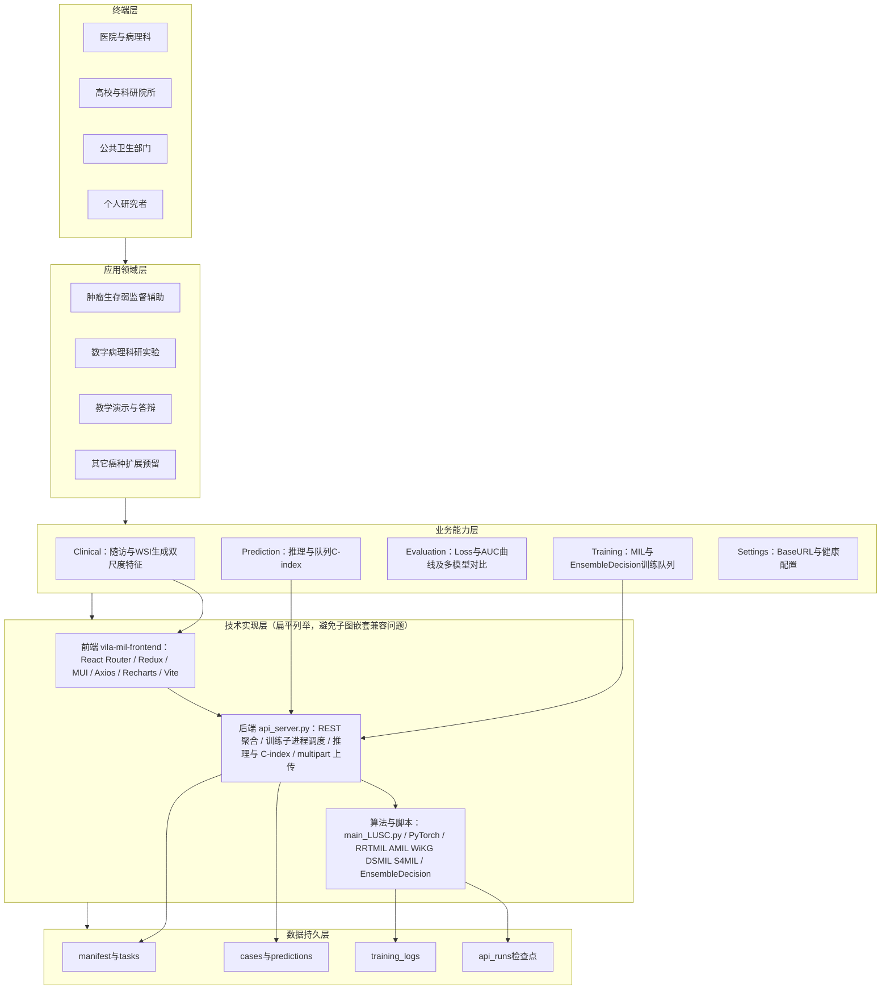
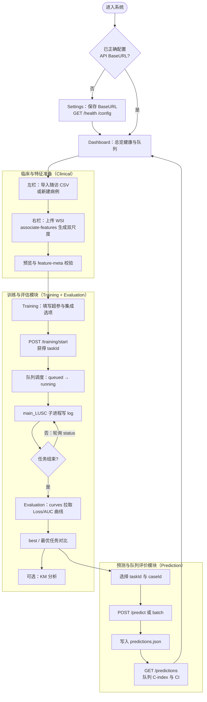

# 第 4 章 系统设计与实现

本章在第三章方法学叙述与实验结论的基础上，从工程实现角度说明**基于病理图像的肺癌生存风险预测系统**（以下简称「本系统」）的需求、架构、业务流程，以及前后端关键模块的设计要点。系统代码由 **ViLa-MIL** 训练与推理仓库（Python / PyTorch）与 **vila-mil-frontend** Web 前端（React）组成；对外通过 **Flask HTTP API**（`api_server.py`）统一暴露数据、训练、评估与预测能力，前端经 **Vite 开发代理**或部署网关将浏览器请求转发至后端 `**/api` 前缀**下的各资源路径。

---

## 4.1 系统需求分析

### 4.1.1 业务需求

本系统面向肺相关癌种（实现中以 **TCGA-LUSC** 等为主）、以全切片或预提取 patch 特征为输入的**弱监督生存风险**辅助分析场景。首先在**数据与特征**侧，系统应能按癌种维护双尺度（如 **20× / 10×**）H5 特征清单，完成特征文件的上传、列表查询与删除，并在需要时支持将光栅病理图（如 SVS 等常见格式经后端转换处理）入库及预览元数据登记，使后续模型与病例始终面对可追溯的文件标识。

在**临床与病例**侧，系统应支持以随访表 CSV 批量导入或单条方式维护**病例编号、生存时间、删失状态**等关键字段，并支持将病例与特征文件建立绑定：既可直接关联已入库的双尺度 H5，也可在用户仅持有 WSI 时由后端在线抽取特征后再写入绑定关系，从而把「随访标签」与「模型输入」固定在同一个 `caseId` 之下。

在**模型训练与评估**侧，系统应覆盖多种 MIL 基线以及 **EnsembleDecision** 决策级集成训练，并允许配置学习率、交叉折数、训练轮数、早停及集成分支参与方式等超参；训练任务需具备入队、状态查询与日志落盘能力，以便评估模块解析 **Loss、AUC** 等曲线并形成摘要，同时支持多任务曲线对比以及 Kaplan–Meier 等扩展分析接口，支撑论文级的过程诊断叙述。

在**预测与队列评价**侧，系统应能对用户选定的检查点任务执行病例级推理，将结果写入预测历史；并在与临床随访字段一致的口径下，对队列汇总 **Harrell C-index** 及可选的 **bootstrap 95% CI**，以便与第三章主表及平台展示规则逐字段核对。最后在**运维与演示**侧，系统应提供健康检查、运行配置的只读展示以及 API 基地址的可配置能力，从而降低实验室部署与答辩演示的环境切换成本。

### 4.1.2 非功能需求

在**可部署性**方面，后端以 **Gunicorn + Flask** 作为容器化入口（默认监听 **8000** 端口），前端静态资源可独立构建并与反向代理组合，使浏览器仅暴露统一站点域名即可访问 `**/api`**。在**可维护性**方面，前后端职责分离，持久化以 **JSON 清单、训练日志文件与按任务划分的运行产物目录**为主，便于版本化备份与实验复现。在**可扩展性**方面，后端通过 `MODEL_CHOICES` 与 `main_LUSC.py` 训练子进程相解耦，新增模型类型时可在后端注册枚举并由前端下拉同步扩展，但须注意前后端常量一致以免出现「可选不可训」的错位。在**安全与资源**方面，上传体积受 `MAX_UPLOAD_MB` 等环境变量约束，训练以子进程方式执行以减轻对 API 工作线程的长时占用；对于批量预测、全量特征抽取等重计算接口，工程上仍建议以单任务串行或限流方式使用，避免演示机资源争用导致超时。

---

## 4.2 系统整体架构

本系统在逻辑上采用与大型医疗信息系统常见的 **「终端—应用—能力—技术—数据」五层纵向模型** 对齐的描述方式：上层回答「谁在用、用在什么场景」，中层回答「系统对外提供哪些可命名能力」，下层回答「用哪些技术栈与哪些持久化载体落地」。物理部署上仍为 **B/S 结构**：浏览器承载单页应用（SPA），经 HTTP(S) 访问 **Flask** 聚合的 `**/api`** 服务；训练与重计算推理在服务端以 **子进程 + 文件型数据湖** 方式组织，而非独立微服务集群，以降低毕设级系统的运维复杂度。

### 4.2.1 分层架构要素说明

**终端层**刻画的是系统服务的使用者与组织形态，本系统主要面向医院病理与肿瘤科、高校与科研院所、公共卫生与队列管理单位，以及个人研究者或小型联合门诊等形态；其中面向真实诊疗外推时须结合伦理与数据合规另行论证，本毕设实现以科研与演示为主。**应用领域层**刻画的是业务边界：在 **TCGA-LUSC** 等公开队列语境下完成弱监督**生存风险排序**，输入可以是病理全切片经离线抽取后的 **H5** 特征，也可以是平台内登记的等价数据对象，并服务于科研对比、消融与教学演示等目的。

**业务能力层**与产品顶栏模块一一对应，可概括为：在 **Clinical** 中完成随访与病例维护及通过 **WSI** 上传由后端生成并绑定双尺度特征，在 **Training** 中完成 MIL 与 **EnsembleDecision** 的训练排队与日志产出，在 **Evaluation** 中完成训练曲线、最优任务对比及可选 KM 分析，在 **Prediction** 中完成单例或批量推理并汇总队列 **Harrell C-index** 与自助区间，在 **Settings** 中完成健康检查与 API 基地址等运行配置。**技术实现层**则落实为前端 **React 18、React Router、Redux、MUI、Axios、Recharts、Vite** 工程与后端 **Flask、flask-cors、Gunicorn、gthread** 服务进程，算法侧通过 **main_LUSC.py** 驱动 **PyTorch** 上的 **RRTMIL、AMIL、WiKG、DSMIL、S4MIL、EnsembleDecision** 等结构，数据交换以 **JSON 清单、HDF5 与 multipart 上传**为主。**数据持久层**将上述行为沉淀为 `**uploaded_features/`** 目录下的 `manifest.json`、`tasks.json`、`cases.json`、`predictions.json`、`best_models.json` 等清单，以及 `**api_training_logs/*.log**` 训练日志与 `**result/api_runs/<taskId>/**` 下的检查点及中间产物，从而形成可备份、可对齐第三章表格口径的完整证据链。

### 4.2.2 图 4-1 系统整体架构图（Mermaid，可导出为高清 PNG）

下图将五层展开为「多框并列」形式，便于与常见学位论文中的**彩色分层架构大图**对应；若学校模板要求使用 **Visio / ProcessOn / PowerPoint** 重绘，可直接按各层框内文字与 **4.2.1 节分层说明** 对齐转绘，版式上可参考「左侧竖排层名 + 右侧分栏模块」的样式。

**制图说明**：在 [Mermaid Live Editor](https://mermaid.live) 或支持 Mermaid 的 Typora / VS Code 插件中打开本章源码，可将上图导出为 **SVG/PNG** 插入 Word；若需与「参考范例」完全一致的**色块分区**（黄/绿/蓝分层底纹），建议在导出矢量图后用 **Illustrator / PPT** 统一配色。

> **【图4-1 截图占位 — 界面版，可与架构图并存】**  
> **内容**：浏览器首页 **Dashboard**，**顶栏七个模块**与系统中文标题同框。  
> **用途**：与上图「逻辑分层」互补，体现真实可点击的产品形态。

**技术栈与路径概要**（与 4.5 节呼应）：开发态 **Vite** 将 `/api` 代理至 `http://127.0.0.1:8000`；生产态前端静态资源与 `**/api` 反向代理**组合；核心持久化文件名与第三章平台口径一致，此处不重复展开。

---

## 4.3 系统流程

本节按**说明书式操作顺序**叙述：先说明用户在本系统界面上依次完成的动作，再给出图 4-2 的流程化概括；技术细节（如接口路径与文件名）已在前文架构与后端小节中交代，此处侧重「用户如何做、系统如何响应」的可读叙述。

用户首先在浏览器中打开本系统单页应用；若训练与推理服务部署在与前端不同的主机或路径下，应先在**设置**页面填写并保存 **API 根地址**，由前端将此后所有请求统一指向该后端入口，并通过健康检查与配置只读区确认服务已连通、数据根路径正确。随后可进入**总览**页面查看病例与训练概况、训练队列与健康状态，作为后续实验的入口界面。

用户在**临床**模块左栏导入随访表或逐条录入病例编号、生存时间、删失指示等字段，使系统内病例对象与队列统计所需临床信息一致。随后在右栏为当前选中病例上传 **WSI**（或常见光栅病理格式），在「快速预览」或「正式预测（TRIDENT）」等策略下由服务器在后台生成 **20× 与 10×** 双尺度特征并写入病例绑定关系；界面以进度条等形式提示长时任务直至结束。系统维护特征相关的**元信息与一致性状态**（例如特征维度是否齐全、双尺度是否成对），并在绑定完成后通过特征元数据接口供前端校验，避免「有随访、无特征」或「仅单尺度」等不匹配情况进入训练与预测环节。用户还可请求缩略预览以肉眼核对切片区域，系统则在校验通过后将病例标记为具备完整推理条件的状态。

**图4-2 系统流程图**

如图4-2所示，当数据与随访准备就绪后，用户进入**训练**页面，从下拉菜单中选择多实例学习模型类型（如 **RRTMIL、AMIL、WiKG、DSMIL、S4MIL** 等单模型，或 **EnsembleDecision** 决策级集成）；若选择集成模式，用户可在界面上指定参与决策融合的基线分支、决策层融合方式等选项，并填写学习率、交叉验证折数、最大训练轮数、随机种子等超参数。系统根据用户提交的配置生成训练任务并加入服务端队列；在资源互斥策略下，训练过程在服务器端以子进程方式执行，运行日志持续写入磁盘，检查点与运行产物按任务编号归档。训练进行过程中，用户可在训练页查看日志片段与任务状态，必要时中止排队或运行中的任务；任务结束后，用户即可在模型评估模块中选中该任务查看曲线与摘要。

用户进入**模型评估**页面后，可在任务列表或运行枚举中选择已完成的训练任务，系统在界面上绘制验证集损失、验证集与测试集 **ROC AUC** 等随训练进程变化的曲线，并支持在「最优任务对比」等视图中将多条模型曲线叠置，以便直观比较不同结构或不同随机种子下的收敛形态。系统还可根据产品规则解析「最佳任务」标识（其中 **EnsembleDecision** 与最新一次成功训练对齐的展示策略与第三章脚注一致）。若用户需要进一步从生存资料角度进行可视化对比，可在评估模块中调用平台提供的 **Kaplan–Meier** 等扩展分析入口，在同一随访口径下查看分组生存曲线，作为对排序指标的过程性补充。

用户随后进入**预测**页面，在任务下拉框中选择已结束且具备可用检查点的训练任务，在病例下拉框中选择待评估病例，点击执行预测；系统在服务器端加载对应权重并完成前向计算，对集成任务则按既定管线汇总多分支证据并输出病例级风险分数。预测结果可在界面上以风险条、分层标签等形式展示；用户若勾选写入历史，系统将把该次预测追加保存，便于后续审计与复现。对于希望跳过预先绑定特征步骤的演示场景，用户亦可使用「自上传图像直接预测」类入口，由服务器先完成特征侧处理再返回风险分数，其主流程仍以「先完成临床与特征闭环、再按病例推理」为推荐路径。

在完成多次预测并形成预测历史后，用户可在预测页查看**各模型队列 Harrell C-index** 汇总表；系统在后台将各模型类型下最新一次写入的病例风险与临床随访字段按可比患者规则对齐，计算一致性指数，并可按需在请求中指定自助法次数以给出 **95% 置信区间**，从而与论文第三章主表及平台截图口径对齐。用户据此可对比不同模型在同一随访队列上的排序能力；若需留存纸质或电子附件材料，可将界面表格与曲线截图归档，或从服务器侧备份 `predictions.json`、训练日志与检查点目录等文件，以满足课题验收与论文材料完整性要求。

上图从模块划分角度概括了「临床与特征准备—训练与评估—预测与队列评价—回到总览」的闭环；正式排版时可将该图导出为矢量或高清位图作为**图4-2**，亦可按学院模板在 **Visio、ProcessOn 或 PowerPoint** 中重绘为横版泳道图以保持与全文图表风格统一。

> **【图4-2 截图占位 — 论文定稿用图】**  
> **内容**：将上方 Mermaid 经 **mermaid.live** 导出 PNG/SVG，或在 **Visio / ProcessOn** 中按同拓扑重绘为带色块分区的中文「图4-2 系统流程图」。  
> **用途**：与正文说明书叙述一一对应，便于评阅人按图索骥。

---

## 4.4 系统前端设计与实现

本系统的前端设计采用当前主流的 **现代化 Web 单页应用技术栈**，以 **React 18** 为视图内核，结合 **Vite** 构建工具、**Material UI（MUI）** 组件库与 **Axios** 异步请求库，并辅以 **Recharts** 完成训练与评估曲线的可视化，整体构成具有**清晰信息层级与即时反馈特性**的病理生存风险分析平台。全局状态由 **Redux** 托管，主题与明暗基线由 **MUI ThemeProvider** 与 **CssBaseline** 统一收敛，使各业务页在字体、间距与色彩上保持同一套视觉语言。与早期大量依赖 jQuery 手动操作 DOM 的页面不同，本系统通过**声明式组件**与**虚拟 DOM 差分更新**降低界面抖动风险，数据获取与提交一律走 **Promise 化的 HTTP 调用**，由前端在路由切换后按需拉取 JSON 并驱动界面重绘，从而在体验上接近「无整页刷新」的流畅切换效果。

系统入口设计为**顶部粘性导航栏加内容区容器**的经典导览结构：顶栏左侧展示系统中文标题，右侧以按钮组形式排列 **Dashboard、Training、Evaluation、Clinical、Prediction、Settings** 等功能入口，当前路由对应的按钮以描边高亮显示，用户一眼即可识别所处模块。首屏 **Dashboard** 采用**分区卡片布局**，以不同顶边色带与浅色底区分「健康与配置」「病例概况」「训练与预测」等总览区块，各卡片内聚合图标、标题、摘要数字与快捷操作，使用户尚未深入子页即可把握系统运行态势。当用户将鼠标悬停在部分卡片或列表行上时，组件样式中预设的过渡（transition）会触发**阴影加深与轻微浮起感**，在不过分干扰阅读的前提下提供可点击或可展开的暗示；在训练、评估等表单密集页面，**MUI Tooltip** 与 **Alert** 提示为学习率、集成分支、任务状态等关键控件补充短说明，降低首次使用成本。

用户点击顶栏任一功能入口后，**React Router** 在浏览器端完成路由切换，内容区在**不重新加载整页 HTML** 的前提下替换为对应业务组件，延续了导览栏所建立的交互范式；各子页内部的列表刷新、日志尾部拉取、曲线数据加载等均由 **Axios** 向后端 `**/api`** 前缀发起异步请求，并在等待期间以 **CircularProgress、LinearProgress** 等组件给出进度反馈，长任务结束或异常时由轻量的 **Toast** 或行内 **Alert** 提示结果。在**训练**板块中，用户可在同一屏内完成模型类型选择（涵盖 **RRTMIL、AMIL、WiKG、DSMIL、S4MIL、EnsembleDecision** 等）、超参数填写、集成策略勾选与训练启停，减少为配置实验而在多窗口之间来回跳转的次数；在**模型评估**板块中，**Recharts** 折线图支持图例开关、悬停提示框与多曲线叠画，便于对照不同任务的 **Loss、AUC** 形态；在**预测**板块中，病例风险以条带、徽标与表格行综合呈现，并与队列层 **C-index** 汇总表同页联动阅读，使「单次推理结果」与「队列层排序结论」在视觉动线上自然衔接。

工程实现上，前端源码位于 `**vila-mil-frontend/`** 目录，入口文件 `**src/main.jsx**` 挂载 Redux、主题与路由后渲染根组件 `**App.jsx**`；业务组件按功能置于 `**src/components/**` 各子目录，HTTP 封装集中于 `**src/services/api.js**`，默认将 **baseURL** 设为 `**/api`**，并允许用户在 **Settings** 页将自定义后端前缀写入 `**localStorage`**，以便实验室部署时无需改打包配置即可切换服务地址。开发环境下 **Vite** 将 `**/api`** 代理至本机 **8000** 端口的后端进程，与生产环境通过反向代理转发的行为一致，有利于答辩现场快速联调。

> **【图4-3 截图占位 — 建议放 4.4 节】**  
> **内容**：**Training** 页完整表单区域（癌种、模型类型、epoch、学习率、k 折、EnsembleDecision 相关选项如决策融合、分支包含等）+ 下方「启动训练」按钮及**历史任务列表**局部。  
> **用途**：体现前端对训练参数的可视化配置及与第三章方法参数的对应关系。

---

## 4.5 系统后端设计与实现

本系统的后端采用 **Python Flask** 构建**单体聚合式 REST 服务**，在 `**api_server.py`** 中以应用工厂 `**create_app()**` 统一注册路由、跨域策略与上传体积限制：启用 **flask-cors** 以便浏览器跨源访问，通过 `**MAX_CONTENT_LENGTH`** 等配置约束单次上传文件大小，避免异常大包占满磁盘。所有对外接口均挂载在 `**/api**` 路径前缀之下，与前端 **Axios** 的默认拼接规则一致；服务既可由 `**python api_server.py`** 直接拉起用于开发调试，也可在容器内由 **Gunicorn** 以 `**api_server:app`** 为入口、配合 **gthread** 工作模式监听 **8000** 端口，从而在答辩或部署环境中获得更稳定的进程级并发能力。

在业务编排上，后端将**轻量查询与重计算解耦**：列表类、配置类、JSON 读写类请求在同进程内快速返回；**模型训练**则通过创建子进程调用 `**main_LUSC.py`** 完成，标准输出重定向至 `**api_training_logs/<taskId>.log**`，任务元数据写入 `**uploaded_features/tasks.json**`，检查点与运行产物落入 `**result/api_runs/<taskId>/**`，由后台调度线程在队列语义下依次拉起，并在进程异常退出或服务重启时将孤儿任务回退为可再次调度状态。训练相关的 `**/training/start、stop、status、history、queue、best、log**` 等接口覆盖从提交到收尾的全生命周期；数据与临床侧则通过 `**/data/*、/clinical/***` 维护特征清单、病例随访与特征绑定；评估模块以 `**/evaluation/curves/<taskId>**` 解析日志曲线，并可选 `**/evaluation/km**` 提供生存曲线分析入口；预测模块以 `**/predict` 系列** 完成单例、批量与光栅快捷推理，以 `**/predictions`** 在服务器端聚合最新 `riskScore` 与 `**cases.json**` 随访字段，按 Harrell 规则计算队列 **C-index**，并支持 `**cindexBootstrap`** 查询参数返回与论文第三章表注一致的 **bootstrap 95% CI**。**EnsembleDecision** 推理路径在服务端按五路基线与决策融合配置组装前向结果，写入 `**predictions.json`** 时附带 `**PREDICT_PROTOCOL_ID**` 等协议字段，便于实验记录与论文复现相互对齐。

部署层面，仓库提供 `**Dockerfile**`，在镜像内安装 `**deploy/requirements-api-app.txt**` 所列依赖后启动 **Gunicorn**；前端 `**npm run build`** 生成的静态资源可由 **Nginx** 等反向代理与 `**/api`** 转发规则一并发布，使外网用户仅暴露单一站点入口即可使用完整功能。持久化数据以 `**uploaded_features/**` 目录下的 **JSON 清单与 H5 文件**、`**api_training_logs/`** 日志以及 `**result/api_runs/**` 训练产物为主，备份时按目录打包即可迁移整套实验环境。

> **【图4-4 截图占位 — 建议放 4.5 节】**  
> **内容**：任选其一：（1）IDE 或文件浏览器中 `**api_server.py`** 顶部常量区（`BASE_DIR`、`DATA_ROOT`、`TASKS_PATH` 等）可见；（2）终端运行 `**curl -s http://127.0.0.1:8000/api/health**` 的 JSON 返回。  
> **用途**：体现后端单入口与数据根路径约定（技术附录可再列完整接口表）。

---

## 4.6 系统界面展示

本节预留**界面截图占位**，正式定稿时请按编号导出 PNG（建议宽度 ≥ 1200px），并在 Word 中替换下方占位文字为「图题 + 图片嵌入」。

> **【图4-5 截图占位 — Dashboard】**  
> **截取页面**：`/` **Dashboard**。  
> **要点**：健康检查状态、数据集/特征统计或训练队列表格任一清晰区域；体现「一屏总览」。

> **【图4-6 截图占位 — Clinical（特征栏）】**  
> **截取页面**：`/clinical` **临床** 右栏「从 WSI 生成并绑定双尺度特征」。  
> **要点**：WSI 选择、快速/正式模式、上传按钮；体现已移除独立 Data 页后的主数据入口。

> **【图4-7 截图占位 — Model Evaluation】**  
> **截取页面**：`/model-evaluation` **模型评估**。  
> **要点**：已选任务的 **Loss 或 AUC 曲线图** + 右侧或下方的任务元数据（含 `taskId`、癌种、模式等）；若有「最优任务对比」多曲线，建议截全图例。

> **【图4-8 截图占位 — Clinical】**  
> **截取页面**：`/clinical` **临床与特征**。  
> **要点**：左右分栏同时可见——左侧病例/随访，右侧特征绑定或 WSI 预览；展示「病例—特征」闭环。

> **【图4-9 截图占位 — Prediction】**  
> **截取页面**：`/prediction` **预测**。  
> **要点**：**各模型队列 C-index** 表（含 *n*、95% CI）+ 下方单个病例预测结果或风险条（与第三章表3-2、图3-2 呼应）。

> **【图4-10 截图占位 — Settings】**  
> **截取页面**：`/settings` **设置**。  
> **要点**：**API BaseURL** 输入框与保存按钮 + 下方 `**/api/config`** 返回的关键路径只读信息。

---

## 4.7 本章小结

本章从需求、架构、流程、前后端实现与界面展示六个方面，说明了肺癌生存风险预测系统的工程形态：前端采用 **React + MUI + Vite** 实现可配置的 REST 客户端与分模块业务页；后端采用 **Flask** 统一暴露训练、数据、临床与预测接口，并以 **JSON + 日志 + 运行目录** 管理实验生命周期。**4.2** 给出与常见论文一致的五层要素总表及 **图 4-1** 展开版 Mermaid 架构图；**4.3** 以说明书式用户操作主线叙述系统流程，并给出 **图 4-2** 三分模块流程图（可再导出为 Visio/PPT 精修矢量图）。文中 **图4-1（界面）～图4-10** 截图占位仍供 Word 排版选用，定稿时按占位说明截取即可。

---

**撰稿说明（可删）**

图号可按学院模板合并或拆分子图（例如将图 4-5～4-10 收成「图 4-2（a）（b）…」）；若学院限制一章插图数量，可优先保留 **图4-1（架构或总览）**、**图4-3（训练）**、**图4-7（评估）**、**图4-9（预测与队列 C-index）** 四条主线截图。目录页码请在 Word 中插入自动目录后由软件更新，**不必**与本 Markdown 手工对齐页码。顶栏英文导航名与真实系统一致；若正文要求全中文叙述，可在首次出现 **Dashboard、Training** 等词时以括注形式给出英文即可。