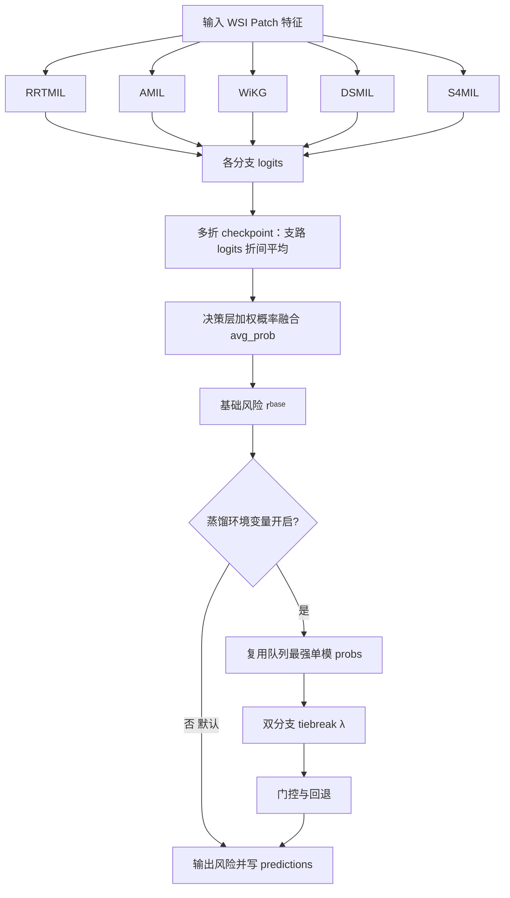
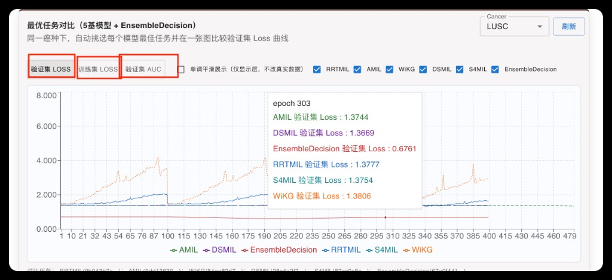
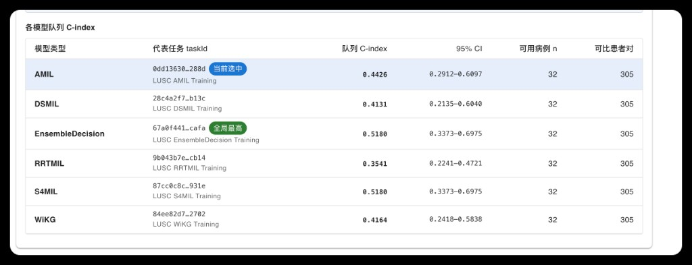
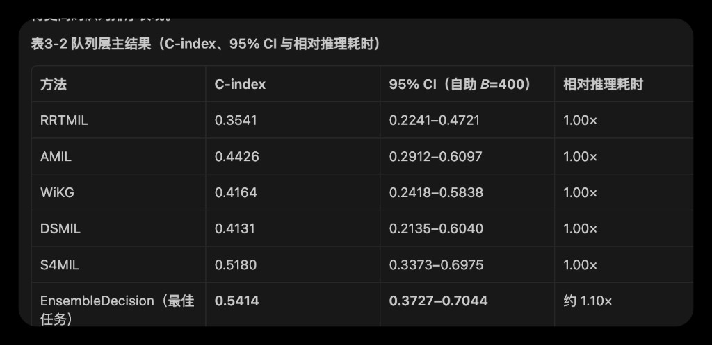

# 第 3 章 基于自适应加权决策集成的肺鳞癌生存风险预测方法

> **与论文章节标题的说明（与实现对齐）**：章名中「特征对齐」「门控融合」等表述沿用课题开题时的 ViLa-MIL 主干叙事；**本章正文在工程上聚焦的集成模块**为平台 **`EnsembleDecision`**——即 **RRTMIL / AMIL / WiKG / DSMIL / S4MIL** 五路基线在 **logits→softmax 概率域** 的 **决策级（后期）规则融合**，**不**在集成头中再训练跨模态特征对齐或可学习门控 MLP。ViLa 主干与 EnsembleDecision 在代码中分属不同 `model_type`，读者对照仓库时请以 `ViLa-MIL/models/EnsembleDecision.py` 与 `api_server.py` 中 `_execute_predict_pipeline` 为准。

## 3.1 引言

全切片病理图像（Whole Slide Image, WSI）具有超高分辨率、强异质性与弱标注特征。直接端到端训练通常面临显存压力大、样本有效监督弱、跨病例分布漂移明显等问题。当前工程可落地的主流流程是：先将 WSI 转化为 patch 级特征，再通过多实例学习（MIL）模型完成病例级风险预测。

不同 MIL 结构具有不同归纳偏置：RRTMIL 偏向全局关系建模，AMIL 强调关键实例加权，WiKG 利用图结构信息，DSMIL 通过双分类器稳定弱监督学习，S4MIL 在长序列建模方面具备优势。单模型往往对特定数据分布敏感，易出现“某一任务最优、跨任务不稳定”的现象。

基于当前系统实际实现，本文采用**决策级集成（EnsembleDecision）**：五路基线各自完整前向得到分类 logits，在 **概率域按支路权重做凸组合**（实现中对外 API 固定为 **`decisionFusion=avg_prob`** 语义），再映射为期望档风险分数写入预测历史；支路权重由 **显式 `decisionBranchWeights` > 由队列 C-index 拼成的 `ensembleBranchPrior` > 活跃支路等权** 的优先链确定，且在**仅自动先验、无显式权重**时，对活跃支路做 **Top-2 截断** 后再归一化，以减轻弱支路稀释概率。  
**预测期默认路径**：加载当前集成训练任务 `resultsDir` 下各折 **EnsembleDecision** 检查点，对支路 logits **折间平均** 后融合（`foldAggregation: mean_branch_logits_then_fuse`），**不**再强行复用「队列 C-index 最高单模」的历史预测——该「最优分支蒸馏 + 二模型 tie-break」链路仅在环境变量 **`VILAMIL_ENSEMBLE_DISTILL_BASELINE=1`** 时启用（默认关闭），以免不同 `ensembleExclude` 配置对同一批病例写出相同 `riskScore`、导致队列 C-index 无法区分。蒸馏开启时，仍可在同一病例上读取次优任务风险并做 **λ 有界** 的轻量方向微调，判据与回退逻辑与 3.8.3 节公式（3-5）—（3-7）一致。  
**训练期集成任务**：`main_LUSC.py` / `core_utils.train` 对 `EnsembleDecision` **不执行**与普通 MIL 相同的「多 epoch 端到端训练循环」，而是在冻结五路基线参数的前提下完成验证集相关评估、**自动分支权重搜索（若配置为 weighted；当前平台表单已收敛为 avg_prob）** 与检查点落盘；因此训练页中的 **`maxEpochs`（如 120）主要服务于各基线单模训练**，集成排队条目的 `maxEpochs` 写入元数据但**不代表**集成子进程会迭代同等次数的融合训练。  
实验数据为 **TCGA-LUSC**：**病例级标注与四折划分**共覆盖 **469** 张互不重复的全切片，并据此完成 k 折训练与折内评估；**部署侧 Harrell C-index 队列汇总**在双尺度特征完备等额外筛查下，**有效病例数为 31～32 例**（详见 3.2.1 与 3.9.1）。

本章结构如下：3.2 给出方法总览（框图与文字要点，不展开编号公式）；3.3-3.7 介绍并训练 5 个基线模型（满足“基线不少于 4 个”）；3.8 系统阐述决策级集成的实现过程（**与 `EnsembleDecisionMIL` 及 API 预测路径对齐**），包括基线参与方式、融合权重与 Top-2、**默认 checkpoint 融合**与**可选蒸馏/tiebreak/门控**；3.9 按“数据构建与样本规模—训练环境与 k 折划分—表3-1及超参阐述—数据加载与训练流程—评价指标—表3-2与表3-3及方法建议—消融与讨论”组织实验与结果；3.10 总结本章工作。

---

## 3.2 方法概述

### 3.2.1 问题定义

本研究以病例级 WSI patch 特征集合作为输入，每个 patch 表示为 d 维向量，模型输出该病例的生存风险评分（分数越高表示风险越高）；训练监督来自生存时间与删失状态，优化目标是在可比较病例对上尽可能提高风险排序与真实生存结局的一致性。实验数据取自 **TCGA-LUSC**（The Cancer Genome Atlas，肺鳞癌）队列。**训练与交叉验证**所依据的病例级元数据来自整理后的**肺鳞癌全切片标注清单**：共 **469** 条记录，对应 **469** 张互不重复的全切片；每条记录给出**病例编号**、**切片编号**、离散风险分层标签、**删失指示**与**生存时间**等，该清单中**病例编号与切片编号一一对应**（即 469 例各含一张纳入划分的切片）。**四份 k 折划分表**在与上述清单对齐后，各自覆盖**同一批 469 张切片**，仅按折重新分配训练、验证与测试角色。在**部署侧 Harrell C-index 统计与表3-2、表3-3 主结果**所采用的口径下，同时满足生存标签与双尺度 H5 特征完备、且与 2026-04-27 实验平台筛查逻辑一致的有效病例数为 **31～32 例**（个别计数在 31 与 32 之间的差异来自“特征完备性/删失可比对”的细微边界，正文统一写作 31～32 例）；该子集规模明显小于上述 **469** 例全量标注队列，故本章区分**“划分与 MIL 训练覆盖的 TCGA-LUSC 切片数（469）”**与**“队列层结论所依据的可评病例数（31～32）”**。

形式化表示如下（Unicode 版）：

𝓧 = {𝐱₁, 𝐱₂, …, 𝐱ᴺ}，且 𝐱ᵢ ∈ ℝᵈ。

符号说明：𝓧 表示一个病例对应的 patch 特征集合（bag）；𝐱ᵢ 表示第 i 个 patch 的特征向量；i 表示 patch 索引；N 表示该病例包含的 patch 总数；ℝᵈ 表示 d 维实数向量空间；d 表示每个 patch 特征的维度。

生存分析样本记为 (T, δ)，其中 T 为生存时间，δ ∈ {0, 1} 为删失指示（δ=1 表示事件发生，δ=0 表示删失）。目标是学习风险评分函数 r(𝓧)，使预测风险在“可比较样本对”上的排序尽量与真实结局一致，评价指标采用 Harrell C-index。

为便于阅读，本章将“可比较样本对”理解为：在统计上可以判定先后顺序的病例对。若模型能在更多此类病例对上给出正确先后排序，则 C-index 越高。

### 3.2.2 方法框图与整体描述

本方法的整体设计遵循“**先以检查点完成五路概率融合**（默认、可区分不同集成配置），**再按需叠加工程增强**”的原则。考虑到单一 MIL 架构在不同病例分布下容易出现优势互补与误差互补并存的现象，本章不直接引入额外的重参数融合网络，而是采用可解释的决策级组合框架：在**默认部署**下，由集成检查点完成五路前向与概率融合得到 **rᵇᵃˢᵉ**；若运维显式开启 **`VILAMIL_ENSEMBLE_DISTILL_BASELINE`**，才进入「复用队列最强单模预测 → 可选 tiebreak → 门控回退」链路。该设计的目标不是追求某一次任务的峰值指标，而是在队列层面获得更稳定、更可复现实验表现，并避免将**可选**增强写死为**必经**步骤而与代码默认行为不一致。

从输入输出关系看，方法输入为同一病例的多分支预测证据（logits 或概率），输出为病例级最终风险分数。**主路径（默认）**：各分支 logits → softmax 得 **𝐩ᵇ** → 按 3.8.1 规则得 **αᵇ** → 式（3-2）—（3-4）得 **rᵇᵃˢᵉ**（与 `EnsembleDecisionMIL.fuse_logits_from_parts` 一致）。**可选路径（环境变量开启）**：在已有单模预测落库时可用强单模概率覆盖，再进入式（3-5）—（3-7）的 λ 与门控。这样分层的好处在于：论文叙述可与仓库默认配置一一对应，同时保留蒸馏增强的**可选**语义。

图示对应本章从“多基线并行预测”到“最终可审计风险分数”的完整路径：**默认**下不经过虚线框右侧的蒸馏分支，直接由 **D→E→F→I**；开启蒸馏环境变量后，才执行 **H→J→K**。各分支输出 logits，经 softmax 得到分支概率；**决策层平均概率融合**对各分支概率加权凸组合，得到 **rᵇᵃˢᵉ**；式（3-5）—（3-7）与符号总表见 **3.8 节**。

可将 3.2.2 理解为模块级“结构视图”，3.8 节理解为变量级“计算视图”；二者结合即可回答：多分支证据如何融合、蒸馏/tiebreak 在代码中**何时启用**、以及门控如何抑制偶然增益。

### 3.2.3 方法设计要点

本文方法可概括为：**默认单路径**（五路 checkpoint → 概率融合 → 风险落库）+ **可选增强路径**（蒸馏 → tiebreak → 门控）。首先收集五路基线的 logits 与概率，在预测阶段通过**决策层平均概率融合**完成决策级组合，得到 **rᵇᵃˢᵉ**；**仅当**部署开启 **`VILAMIL_ENSEMBLE_DISTILL_BASELINE`** 时，才允许用历史最优单模预测覆盖并进入由式（3-5）—（3-7）描述的 λ 与门控。训练提交集成任务时，`POST /api/training/start` 若启用 **`ensembleBranchPriorAuto`** 且未手写先验，会在**同进程**内扫描 `predictions.json`：当前实现**仅对 tasks.json 中模型类型属于五路基线的 taskId** 计算队列 C-index 以拼先验字符串（避免对 ViLa/集成等全部任务做全表 cohort 聚合导致接口长时间阻塞）。整体上，3.2.3 与 3.8 共同给出与仓库一致的行为边界。

---

## 3.3 基线模型一：RRTMIL 及训练

RRTMIL（Region Relation Transformer MIL）强调将病理 patch 之间的区域关系显式建模，再进行袋级汇聚。其思想是先在实例层建立区域内与跨区域的依赖，再通过注意力汇聚获得病例级表示，因此对“证据分散、远距离关联明显”的样本更有优势。

在论文表述中，关系编码可写为

H = f_RRT(X),

其中 X 为 patch 特征序列，H 为关系增强后的实例表示。随后通过注意力汇聚得到袋级表示与预测：

αᵢ = softmax(q(hᵢ)),  h_bag = Σᵢ αᵢ hᵢ,  z = W h_bag + b。

该模型在本章中主要提供全局关系证据，与后续注意力模型、图模型和状态空间模型形成互补。

训练设置采用与其它基线一致的输入特征来源、数据划分与评估协议，以保证后续集成阶段分支输出的可比性。

---

## 3.4 基线模型二：AMIL 及训练

AMIL（Attention-based MIL）是典型的实例注意力加权聚合框架，核心思想是通过可学习权重突出对病例判别最关键的 patch。相较于强调全局关系的模型，AMIL 更擅长提取“局部强证据”。

标准注意力形式可写为

aᵢ = wᵀ tanh(Vhᵢ),  αᵢ = exp(aᵢ) / Σⱼ exp(aⱼ),

并由此得到袋级表示与输出：

h_bag = Σᵢ αᵢ hᵢ,  z = W h_bag + b。

门控注意力形式进一步写为

aᵢ = wᵀ (tanh(Vhᵢ) ⊙ σ(Uhᵢ))，

其中 ⊙ 表示逐元素乘法。该机制在弱监督条件下能够提高关键区域识别能力。

训练口径与其它基线一致，以保证后续决策级集成中的分支可比性。

---

## 3.5 基线模型三：WiKG 及训练

WiKG（Weakly-supervised Knowledge-guided Graph）将 WSI 视作弱监督图学习问题，核心在于先构建邻域关系，再进行节点与图级聚合。该模型对于“结构模式主导”的病例具有优势，可补足纯实例注意力模型的结构盲区。

其关键步骤可写为：

Sᵢⱼ = φ(hᵢ, hⱼ),

其中 Sᵢⱼ 为节点相似度；基于 S 选择每个节点的 Top-K 邻域 Nᵢ 后，进行邻域聚合

mᵢ = Σ_{j∈Nᵢ} βᵢⱼ hⱼ,  hᵢ' = ψ(hᵢ, mᵢ)。

最后经图级读出得到

h_graph = Readout({hᵢ'}),  z = W h_graph + b。

训练与评估口径与其它基线统一，以保证后续集成阶段输出可直接对齐。

---

## 3.6 基线模型四：DSMIL 及训练

DSMIL（Dual-stream MIL）采用实例分支与袋分支并行协同的思想：实例分支强调“最显著局部证据”，袋分支强调“整体判别稳定性”，二者共同缓解弱监督学习中只看局部或只看全局带来的偏差。

其形式化表达可写为

cᵢ = f_inst(hᵢ),

其中 cᵢ 为实例级分数；随后由袋分类器融合实例特征与实例分数：

z_bag = f_bag({hᵢ, cᵢ})。

最终输出通常以袋级结果为主（或与实例级监督联合）：

z = z_bag。

训练协议与其它基线一致，保证在集成阶段能够进行公平对比与联合决策。

---

## 3.7 基线模型五：S4MIL 及训练

S4MIL 将 MIL 问题中的 patch 序列视为长序列动态系统，利用状态空间模型（S4）刻画远程依赖。该类方法在序列较长、局部证据分散的场景中通常具有更稳定的建模能力。

状态空间模型可写为连续形式

x'(t) = A x(t) + B u(t),  y(t) = C x(t) + D u(t),

离散化后对应

x_k = Ā x_{k-1} + B̄ u_k,  y_k = C x_k + D u_k。

在 MIL 任务中，序列输出 {y_k} 经过池化得到袋级表示 h_bag，再经分类头得到 logits。

训练口径与其它基线统一，以保证五分支输出可以在同一决策层进行融合比较。

### 3.7.1 基线汇总（满足“4 个以上基线”要求）

| 编号  | 模型     | 技术路线             | 集成角色    |
| --- | ------ | ---------------- | ------- |
| B1  | RRTMIL | Transformer 关系建模 | 全局上下文   |
| B2  | AMIL   | 门控注意力 MIL        | 关键实例聚焦  |
| B3  | WiKG   | 图消息传递            | 邻域结构补充  |
| B4  | DSMIL  | 双分类器 MIL         | 稳健弱监督聚合 |
| B5  | S4MIL  | 状态空间序列建模         | 长程依赖补充  |

---

## 3.8 决策级集成学习方法的实现过程

3.2 节用框图概括了“**融合（默认）**—**可选蒸馏—可选 tiebreak—门控**”的分层思路。本节按**与 `ViLa-MIL/models/EnsembleDecision.py`、`api_server.py` 中 `_execute_predict_pipeline` 一致**的顺序写清集成在做什么：先说明基线池与参与、融合权重与 Top-2 规则，再写**决策层平均概率融合**得到基础风险，最后区分**默认预测路径**与**环境变量开启时的蒸馏 / tiebreak / 门控**。公式（3-1）—（3-7）与符号总表见 3.8.4。本文集成是规则型决策级组合，不引入可训练跨模态融合头；与论文题目中「特征对齐 + 门控 MLP」所指的 **ViLa 主干**为不同模块，见章首说明。

### 3.8.1 基线池、参与方式与融合权重选择策略

集成对象固定为五类 MIL 基线：RRTMIL、AMIL、WiKG、DSMIL、S4MIL，与 3.3—3.7 各节分别训练得到的任务与权重一一对应。集成模块本身不再学习新的特征变换，只在各基线已给出的 logits 或概率上做组合。

参与融合的支路可以通过配置临时关掉其中若干路，例如出于算力或稳定性考虑，但不得五路全部关闭。被关掉的分支在融合权重视为 0，其余分支的权重在归一化意义上重新分配；仍参与融合的分支在本文记号里记为 b=1,…,K，通常 K=5。

融合权重 αᵇ 的确定遵循一条明确的优先链。若实验者直接给出各基线的非负相对权重，则归一化后即为 αᵇ，此时不再强行做“只保留两路”的截断，以免覆盖人工意图。若没有显式权重，但提供了由队列 C-index 等写成的分支先验——既可以是人工表，也可以由系统在“同癌种、同特征模式”下按各基线历史最好表现自动填表——则先把先验转成非负向量，再归一化得到 αᵇ。若上述两类信息都不存在，则对当前仍活跃的分支采用等权。在先验来自队列自动估计、且并未同时给出显式权重的前提下，融合投票会再做一个保守处理：只保留先验最高的两个分支，其余分支权重清零后重新归一化，以避免弱分支在概率平均里把高置信度摊薄；一旦改用显式权重，这一截断即取消。

训练阶段主要回答“哪些基线进入融合、αᵇ 取何分布”。**集成训练任务**在 `core_utils.train` 中对 `EnsembleDecision` **不走**与普通 MIL 相同的 `for epoch in range(max_epochs)` 主循环：在**冻结五路基线**的前提下加载各折检查点、（若配置）在验证集上搜索决策权重并保存集成检查点；训练页填写的 **`maxEpochs`（如 120）用于各基线单模训练**，勿与集成子进程是否迭代同数目的「融合 epoch」混读。  
预测阶段在集成任务上还要回答“与哪几条已训练任务对齐”，这与 αᵇ 是两条线。**默认（`VILAMIL_ENSEMBLE_DISTILL_BASELINE` 未开启）**：直接加载当前集成任务的 **EnsembleDecision** 多折检查点，对支路 logits **折间平均** 后按 3.8.2 融合并写 `predictions.json`（`predictProtocolId` 以仓库 `PREDICT_PROTOCOL_ID` 为准，随协议变更而更新）。**仅当蒸馏环境变量开启时**：才在落库历史上按任务粒度统计队列 C-index，取当前癌种与 mode 下**排名第一的基线任务**；若该病例在该任务上已有预测，可复用其概率，并继而执行 tiebreak 与门控。若历史记录不足以支撑蒸馏，则与默认路径一致，退回集成检查点五路前向。`POST /api/training/start` 在自动拼 `ensembleBranchPrior` 时，实现上**只对五路基线类型的 taskId** 计算 cohort C-index，与「全任务 cohort 大表」在结果上等价于仅基线行参与先验，但显著降低请求耗时。

### 3.8.2 决策层平均概率融合与基础风险

对每一例、每一活跃分支 b，分类头先给出 G 档离散风险上的 logits 向量 𝐳ᵇ，再按下式得到分支概率并在概率域融合、折期望档风险。

（3-1） 𝐩ᵇ = softmax(𝐳ᵇ)，其中 𝐩ᵇ 表示第 b 个分支的 G 维概率向量；𝐳ᵇ 表示该分支分类头输出的 logits 向量；b 为分支编号；softmax(·) 表示对向量做指数归一化，使各分量非负且和为 1。

（3-2） 𝐩ᶠᵘˢᵉ = Σᵇ₌₁ᴷ αᵇ 𝐩ᵇ，且 αᵇ ≥ 0，Σᵇ₌₁ᴷ αᵇ = 1，其中 𝐩ᶠᵘˢᵉ 表示融合后的 G 维概率向量；αᵇ 表示第 b 个分支的融合权重；K 表示参与融合的活跃分支个数；Σᵇ₌₁ᴷ 表示 b 从 1 到 K 求和；𝐩ᵇ 的含义同式（3-1）；约束 αᵇ ≥ 0 且 Σαᵇ = 1 表示对分支概率做凸组合，αᵇ 的取值规则见 3.8.1。

（3-3） 𝐳ᶠᵘˢᵉ = log(𝐩ᶠᵘˢᵉ + ε)，其中 𝐳ᶠᵘˢᵉ 表示将融合概率映射回 logits 域后的 G 维向量；log(·) 表示自然对数；𝐩ᶠᵘˢᵉ 的含义同式（3-2）；ε 表示远小于 1 的正数，用于避免 log(0)。

（3-4） rᵇᵃˢᵉ = Σ(g=0→G−1) g · pᶠᵘˢᵉ(g)，其中 rᵇᵃˢᵉ 表示由融合概率得到的标量基础风险（期望档）；g 表示离散风险档的序号；G 表示档的总数；pᶠᵘˢᵉ(g) 表示 𝐩ᶠᵘˢᵉ 在第 g 档上的概率分量；Σ(g=0→G−1) 表示 g 从 0 到 G−1 累加。该标量与由融合概率折算期望风险的常用展示写法同构，便于与亚风险分层衔接。

### 3.8.3 预测期流程：默认 checkpoint 融合与可选蒸馏 / tiebreak / 稳健门控

**（1）默认路径（与当前仓库默认配置一致）**  
预测请求在 **`modelType=EnsembleDecision`** 的任务上到达时，**除非**环境变量 **`VILAMIL_ENSEMBLE_DISTILL_BASELINE`** 置为真，否则**不**优先查找「队列 C-index 最高的基线任务」的历史预测；而是加载该集成任务 `resultsDir` 下各折 **EnsembleDecision** 检查点，对五路基线各做一次前向得到 **parts**（形状含 5 个分支维），**对多折 logits 取平均** 后调用 **`fuse_logits_from_parts`**，再经 softmax 与期望档折算得到写入 `riskScore` 等字段。该路径保证不同 **`ensembleExclude` / 检查点** 对同一病例可产生**不同**风险轨迹，便于在 Prediction 页按 `taskId` 区分队列 C-index。

**（2）可选蒸馏与 tiebreak（`VILAMIL_ENSEMBLE_DISTILL_BASELINE=1` 等）**  
当且仅当开启上述环境变量、且能解析到队列意义下的「最强基线」且该病例在该基线任务上已有 **4 类概率 `probs`** 时，方可**跳过**集成检查点前向，直接复用其概率；并可调用 `_learn_two_model_tiebreak_strategy` 在「最优 / 次优」两任务风险之间做 **λ 有界** 微调（见式（3-5）及实现中的 `lambdaCap` 等）。**若无此类记录或环境变量关闭**，行为同（1）。蒸馏路径给出的是**工程意义上的下界增强选项**，而不是默认必经步骤。

**（3）门控与回退**  
在启用 tiebreak 的前提下，λ 的采纳仍由式（3-6）（3-7）及实现中的验证子集 / 时间切分逻辑判定；若不满足最小增益或全队列退化，则 **λ 回退为 0**。以下公式在**蒸馏 + tiebreak 均被激活**时完整适用；默认仅 checkpoint 融合时，读者可将 rᵇᵉˢᵗ、rˢᵉᶜᵒⁿᵈ 与 λ 相关步骤理解为**未进入主路径**。

（3-5） r_λ = rᵇᵉˢᵗ + λ · sign(rˢᵉᶜᵒⁿᵈ − rᵇᵉˢᵗ)，其中 r_λ 表示引入系数 λ 后该病例的风险分数；rᵇᵉˢᵗ 表示队列 C-index 排名第一的训练任务在该病例上的风险；rˢᵉᶜᵒⁿᵈ 表示排名第二的训练任务在该病例上的风险；λ 表示微调幅度（非负标量）；λ_cap 表示 λ 允许取到的上界（实现中取 0.10）；sign(·) 表示符号函数，对自变量 rˢᵉᶜᵒⁿᵈ − rᵇᵉˢᵗ 而言，差值为正时取 +1，为负时取 −1，为零时取 0。

采纳非零 λ 前需在验证子集与全队列上检验 Harrell C-index；记验证子集与全队列上的 C-index 泛函分别为 Cᵛᵃˡ(·) 与 Cᵃˡˡ(·)，λ=0 时基准风险为 r₀（与 rᵇᵉˢᵗ 对齐、即不施加式（3-5）中 sign 项），则验证增益写为

（3-6） Δᵛᵃˡ(λ) = Cᵛᵃˡ(r_λ) − Cᵛᵃˡ(r₀)，其中 Δᵛᵃˡ(λ) 表示在验证子集上，采用 r_λ 相对采用 r₀ 的 C-index 提升量；Cᵛᵃˡ(r_λ) 表示以风险序列 r_λ 在验证子集上算得的 C-index；Cᵛᵃˡ(r₀) 表示以基准风险 r₀ 在验证子集上算得的 C-index；减号表示两标量之差。

回退判据为

（3-7） Δᵛᵃˡ(λ) < δₘᵢₙ 或 Cᵃˡˡ(r_λ) < Cᵃˡˡ(r₀)，其中 δₘᵢₙ 表示验证集上可接受的最小 C-index 增益阈值（实现中默认 0.01）；Δᵛᵃˡ(λ) 的含义同式（3-6）；Cᵃˡˡ(r_λ) 表示以 r_λ 在全队列上算得的 C-index；Cᵃˡˡ(r₀) 表示以 r₀ 在全队列上算得的 C-index；“或”表示两不等式任一成立即触发回退。成立时强制 λ=0。时间切分按预测时间约 70%/30% 划分，用于在 λ 网格上比较 Cᵛᵃˡ；若未触发式（3-7），则输出 r_λ，否则输出 r₀ 对应风险。

上述预测链路与更新后的 3.2.2 框图一致：**决策层平均概率融合**与 rᵇᵃˢᵉ 对应“融合”；**默认**下由 **D→E→F→I** 完成落库；**可选**分支中历史最优覆盖对应“蒸馏”；式（3-5）与 λ 搜索对应“双分支轻量校准”；式（3-6）（3-7）与 λ_cap 对应“稳健门控与回退”。

### 3.8.4 公式编号索引、符号总表与方法边界

| 编号    | 含义                         |
| ----- | -------------------------- |
| （3-1） | 分支 softmax 概率              |
| （3-2） | 决策层加权概率融合（平均概率凸组合）         |
| （3-3） | 融合概率到 logits 的稳定对数映射       |
| （3-4） | 由融合概率期望档得到基础风险 rᵇᵃˢᵉ       |
| （3-5） | 最优 / 次优双任务 tiebreak        |
| （3-6） | 验证集 C-index 提升量 Δᵛᵃˡ(λ)    |
| （3-7） | 回退触发条件（最小验证增益 δₘᵢₙ 与全量不退化） |

符号总表。b：分支索引；K：参与融合的活跃分支数；G：离散档数；g：档索引；𝐳ᵇ、𝐩ᵇ：第 b 路 logits 与概率；αᵇ：融合权重（由 3.8.1 规则确定）；𝐩ᶠᵘˢᵉ、𝐳ᶠᵘˢᵉ：融合概率与融合 logits；ε：对数稳定项；rᵇᵃˢᵉ：基础期望档风险；rᵇᵉˢᵗ、rˢᵉᶜᵒⁿᵈ：队列 C-index 排名第一、第二的任务在该病例上的风险；r_λ：tiebreak 后风险；r₀：λ=0 基准；λ、λ_cap：微调系数及其上界；Cᵛᵃˡ、Cᵃˡˡ：验证子集与全队列 C-index；Δᵛᵃˡ(λ)：验证增益；δₘᵢₙ：最小可接受验证增益；sign：符号函数。

本文当前系统版本属于**规则型决策级集成（`EnsembleDecision`）**，而非端到端可训练特征融合网络；**默认预测**不经过蒸馏时，与「深层跨模态特征学习器」差距更大、但**与仓库默认行为一致**。本章结论聚焦于工程可复现、队列排序稳健与部署可追溯；若论文叙述需强调「蒸馏 + tiebreak + 门控」完整链，须在实验设置中**显式声明**已开启 **`VILAMIL_ENSEMBLE_DISTILL_BASELINE`**，否则与线上默认配置不对齐。

---

## 3.9 实验与结果

### 3.9.1 数据构建、样本规模与训练环境及划分协议

数据自 **TCGA-LUSC**（肺鳞癌）公开队列整理为**病例级标注清单**：共 **469** 张互不重复的全切片，每例含**病例编号**、**切片编号**、离散风险分层标签、删失指示与生存时间等元数据，并可与公开临床注释互查。实验管线按“**清单—划分—张量**”组织：清单与 **k = 4** 套交叉验证划分表对齐后，为每一折分别构造训练、验证与测试子集；数据载入按**袋级批量**送入训练循环。病理图像经预提取后，**20×** 与 **10×** 两档倍率下的特征分别存入对应特征库，并与清单中的切片一一对应；主实验以**袋级特征向量**为网络输入。另设面向全切片联机读入与特征补全的读片与批组织子流程，供在线预测使用。

**样本规模（与划分一致的全量）**：上述清单共 **469** 条切片级记录，**病例编号与切片编号一一对应**，折合 **469 例**。配套**四套**划分表各含 **281** 行，在与清单对齐后**各自覆盖同一批 469 张切片**，仅重新分配训练、验证与测试，不改变队列总数；折数 **k = 4** 与四套划分一一对应。

**469 例与 31～32 例怎样区分**：二者不是两批无关数据，而是**同一条 TCGA-LUSC 队列在“训练用全量”和“主表能算多少人”上的口径差别**。划分与 MIL 训练按清单把 **469** 张全切片都纳入折次流程；到了汇总 **Harrell C-index**、填写表3-2 与表3-3 时，还会再丢掉那些**双尺度特征尚未齐套**或**随访与删失信息对不齐**的个案，因此在 **2026-04-27** 这次实验记录里，真正能并进主表的只有大约 **31～32 例**（31 与 32 差 1 例，来自筛查边界，后文统一写作 31～32 例）。换句话说：**469** 回答的是“模型在多大范围上练过”，**31～32** 回答的是“排队算分时还有多少人条件齐备”。除另有说明外，本章凡讨论 C-index 高低、方法优劣，**都指这三十余例的评估子集**。

本文在 **PyTorch** 框架下完成上述 **469** 张切片的特征袋多实例学习训练，并完成决策级集成方法 EnsembleDecision 的训练与在线部署对接。运行环境包括 Python 3.10.20、PyTorch 2.11.0 与 Flask 3.1.3。本文**实测以 CPU 训练与推理为主**；若运行环境具备 **GPU** 且框架检测到加速设备可用，则训练与推理可自动启用 GPU，**不改变算法结构**；正文不绑定特定显卡型号与显存配置。

针对 **TCGA-LUSC** 生存弱监督设定，采用 **k = 4 交叉验证**：每折以**训练集**更新 MIL 主干，以**验证集**监控损失与 ROC AUC，以**测试集**参与折内评估；每折结束后保存**模型检查点**，供后续评估与任务快照读取。在同时满足 **WSI 可及、生存与删失可对齐、双尺度 H5 完备** 的统计口径下，**部署侧 Harrell C-index 汇总及表3-2、表3-3 的有效病例数为 31～32 例**（2026-04-27 实验记录）。**本文结论限定于 TCGA-LUSC、该 469 例清单与四折划分、k=4 及上述快照日期**，不将单次结果外推为大规模独立测试集的普适规律。

在上述划分与同一特征模式下，本文对 RRTMIL、AMIL、WiKG、DSMIL、S4MIL 五类代表性 MIL 结构分别进行了系统性训练，以覆盖不同的归纳偏置与聚合机制；并进一步启动 EnsembleDecision 任务，在加载五路基线权重的前提下完成集成前向、评估曲线生成与**模型检查点**落盘，使预测期能够按 **3.8** 节所述，在**默认**下以 **checkpoint 概率融合**完成队列级推理，并在运维显式开启 **`VILAMIL_ENSEMBLE_DISTILL_BASELINE`** 时再叠加蒸馏、双任务 tiebreak 与门控回退。各基线遵循**各自网络类型**对应的结构与损失接口，集成侧不新增可训练融合主干，从而保证“单模训练—集成组合”在方法边界上的清晰性。

模型训练参数设置如表3-1所示，以下对关键超参数及其设置依据进行详细阐述。

**表3-1  模型训练主要参数及取值**

| 类别       | 参数       | 符号（沿用训练配置中的记法）      | 取值或说明                                                    |
| -------- | -------- | ------------------- | -------------------------------------------------------- |
| 数据与任务    | 癌种与任务设定  | —                   | LUSC（肺鳞癌）；亚风险分层任务，与标注清单及划分一致                             |
| 数据与任务    | 病例清单规模   | —                   | **469** 张互不重复全切片（病例编号与切片编号一一对应）                          |
| 数据与任务    | 交叉验证划分   | k                   | **k = 4**；四套划分表与清单对齐，每表 **281** 行，覆盖同一 **469** 张切片       |
| 特征输入     | 双尺度预提取特征 | —                   | **20×** 档与 **10×** 档两路袋级特征，与清单中切片一一对应                    |
| 训练协议     | 最大训练轮次   | max_epochs          | **100**（实验中亦常取 **120**）；与四折叠加时总轮次约 **4×100** 或 **4×120** |
| 训练协议     | 早停（可选）   | patience，stop_epoch | 启用早停时：耐心 **20** 轮，最早自第 **80** 轮起可触发；默认可不启用               |
| 优化       | 学习率      | lr                  | **1×10⁻⁵**                                               |
| 优化       | 优化器      | opt                 | Adam                                                     |
| 优化       | 权重衰减（L2） | reg                 | **1×10⁻⁵**                                               |
| 批次与损失    | 袋级批量大小   | bs                  | **1**（每步更新对应一例一袋）                                        |
| 批次与损失    | 袋级分类损失   | bag_loss            | 交叉熵（**ce**；消融中可换支持向量机或 focal 形式）                         |
| 正则化      | 随机失活     | drop_out            | 默认**启用**                                                 |
| 复现性      | 随机种子     | seed                | **1**                                                    |
| 复现性      | 训练标签使用比例 | label_frac          | **1.0**（使用全部可用训练标签）                                      |
| 结构（部分基线） | 文本原型数    | prototype_number    | **16**                                                   |

表3-1 自上而下依次为：**数据与任务口径**（含 469 例与四折划分）、**特征输入形式**、**训练轮次与可选早停**、**优化与袋级批量及损失**、**正则与复现性**、以及**个别模型用到的结构超参**。其中 **469** 与 **281** 的含义与 3.9.1 节文字一致；**k** 与 **max_epochs** 的乘积关系见「最大训练轮次」一行说明。

学习率用于控制参数更新步长。本文将学习率初始值取为 **1e-5**。较高的学习率在小样本、袋级梯度噪声较大时易致损失震荡与验证指标不稳；过低则显著拉长达到可用验证性能所需的轮次。综合可观察收敛行为，**1e-5** 在收敛速度与稳定性之间折中较好。

批量大小表示每次更新所消耗的样本单元数。本系统在 MIL 管线中采用**袋级**组织，由深度学习框架的数据迭代器以**每批一例（一袋）**装载完整特征袋及标签。该设置符合病理 MIL 常见做法：单张 WSI 对应实例数量极大，增大袋级批量将显著抬高显存与工程复杂度；批量取 1 有利于在有限资源下稳定反传，并与本文 CPU 实测环境相匹配。

最大训练轮次记为 max_epochs，表示外层 epoch 上限。本文默认 **100**，实验中亦常见 **120**；与 **k = 4** 叠加时，总轮次预算约为 **4×100** 或 **4×120**。若启用**早停策略**，则当验证监控量连续若干轮无改善且已超过预设最早生效轮次时可提前终止，以在充分拟合与避免无效长跑之间折中；未启用时则训练至 max_epochs 上限。

交叉验证折数 **k = 4**，用于在 **31～32 例**可评队列这一小样本条件下获得多份可比较的折次轨迹。受样本量限制，C-index 在表3-2 中仍以**点估计**为主结论；其 **95% 置信区间**采用与部署平台一致的**患者有放回自助法**（见 **3.9.3.1**），在冻结 `predictions.json` 与 `cases.json` 后由与 `GET /api/predictions?cindexBootstrap=400` 相同的规则复算得到并填入表内。**外部队列独立验证**仍可作为后续工作，与表中自助区间回答的问题不同。

权重衰减取 **1e-5**，与 Adam 联用，在自适应步长与轻微 **L2** 正则之间折中，抑制袋级过拟合。**袋级分类损失**以交叉熵为主，消融中可替换为支持向量机或 focal 形式以检验代理目标差异。**随机失活**默认开启。**随机种子**与**训练标签使用比例**分别用于固定随机性与使用全量可用标签，便于复现。各 MIL 变体特有的结构超参（如部分模型使用的文本原型数）取统一默认，使各结构在可比默认配置下训练。各折结束后将模型状态写入**按折次索引的检查点文件**，保存节律与训练轮次对齐，供平台评估与快照读取。

在模型训练过程中，优化器采用 Adam 算法，其结合一阶与二阶矩估计的自适应步长机制，能够减轻手工逐维调学习率的压力，并在非凸深度学习目标上广泛使用。本文在默认配置下选取 Adam，与社区 MIL 训练实践保持一致。

### 3.9.2 数据加载、特征形式与训练流程

在数据加载阶段，训练与验证样本自预提取的**双尺度 H5 特征库**中按顺序或随机策略遍历（是否加权依划分与配置而定）。**20×** 与 **10×** 两档特征与 patch 提取倍率一致，模型前向同时消费两路张量以形成多尺度证据。特征载入后转为浮点类型并在 **CPU** 或 **GPU** 上统一计算。本文不在 patch 像素域以随机翻转等为主做增广，而依赖队列内病例异质性与 MIL 聚合结构提升表达；若特征缺失，可由全切片经**在线特征提取**补全后进入同一训练管线。

训练主循环在每个 epoch 内依次执行袋级前向、损失回传、优化器步进与验证评估；验证阶段除记录 ROC AUC、分类误差与损失外，还可记录与生存排序一致的验证 C-index 等，用于分析**分类代理目标**与**生存排序目标**的对齐程度。集成任务在载入五路基线检查点后，以 **3.8** 节所述的**冻结支路 + 决策权重搜索（若配置）+ 集成检查点落盘**为主；部署预测时的 logits 与概率默认来自该检查点融合路径，而非蒸馏分支。

通过上述环境与协议，本文获得了五类 MIL 基线在 TCGA-LUSC 子风险任务上的成套训练记录，以及 EnsembleDecision 在相同统计口径下的队列评估结果；具体的训练效果、性能评价指标与方法选择讨论将在下文结合表格给出。

### 3.9.3 评价指标

除下文数学定义外，**工程平台将指标拆成多层展示**（与 **3.9.3.2** 对照阅读）：**模型评估（EVALUATION）**页的训练曲线与摘要来自**训练日志解析**（折内验证/训练子集）；**预测（PREDICTION）**页的队列表来自**预测历史 + Clinical 随访**；任务列表（Training / Dashboard）另有**摘要字段**。三者应对齐到**同一 taskId** 后再比较，**不可把验证集 AUC 曲线直接等同于队列 Harrell C-index**。

在病理 WSI 生存风险预测任务的性能评估中，**Harrell C-index（一致性指数）**与 **受试者工作特征曲线下面积（ROC AUC）** 分别承担“队列排序主结论”与“训练过程诊断”两类角色，二者互补而不应混为一谈。

C-index 用于衡量病例级风险评分与生存结局之间的一致性。设可比较病例对集合由删失机制诱导，模型对病例 i、j 给出的风险为 rᵢ、rⱼ，真实生存时间为 Tᵢ、Tⱼ，删失指示为 δᵢ、δⱼ，则在经典可比较对定义下，C-index 可理解为：在所有可被判定先后顺序的对上，模型排序与真实结局顺序一致的比例，并对平局对赋予 0.5 权重；其取值在 0 与 1 之间，0.5 常作为随机排序的参考线，越接近 1 表示队列风险排序与真实可比较结局越一致。由于本文最终结论强调部署队列上的排序能力，因此将 C-index 作为论文主指标。

ROC AUC 与验证损失、分类误差、F1 等一同构成训练日志层指标，用于观察各 MIL 结构在不同折次上的收敛形态、过拟合风险与代理目标优化质量。**验证 AUC 的峰值与队列 C-index 并不总是同向**，原因在于折内验证划分与 **31～32 例**队列上的部署统计集合并不完全相同，且删失比例与可比较对的构造方式亦不相同。本文因此采用**双层指标**：训练日志层用于过程诊断，队列 C-index 层用于最终排序评价；表3-2 中 **95% CI** 为队列层自助区间（**3.9.3.1**），与点估计同一 Harrell 可比患者对规则。

#### 3.9.3.1 队列 C-index 的 95% 置信区间（与平台实现一致）

部署侧在 `GET /api/predictions` 中对**单一 `taskId`** 汇总：每个 `caseId` 取该任务下**时间最新**一条预测的 `riskScore`，与 Clinical 中同一病例的随访 `time` / `status`（删失指示）配对；在「较早时间点若发生事件则可比较」的病例对上，按风险分数高低计一致、不一致与平局（平局权重 0.5），得到与正文 **Harrell C-index** 口径一致的点估计。

**95% 置信区间**在**同一可比患者规则**下，对患者索引做 **有放回自助**（bootstrap sample 量等于可用病例数 *n*），重复 *B* 次（本文表3-2 取 **B = 400**，与平台环境变量 `VILAMIL_CINDEX_BOOTSTRAP_B` 缺省一致；单次请求可用 `cindexBootstrap` 覆盖）。每次自助子样本上重算 C-index，取自助分布的 **2.5% 与 97.5% 分位**作为近似 95% 区间；随机种子取 **42**（`VILAMIL_CINDEX_BOOTSTRAP_SEED`）。该做法与 lifelines 等软件在加权 / IPCW 等扩展上的实现可能略有数值差异，但便于与平台 Prediction 页、接口字段 `cIndex95Ci` **逐字段对齐**。

表3-2 中**五路基线**各行的 **taskId** 与预测页「各模型队列 C-index」表一致：在 `GET /api/predictions` 返回的按任务统计中，对每个 `modelType` 取 **队列 C-index 最大**的一条作为该类型的**代表任务**（可比患者对数、可用病例数等为平局时的次序规则与 `Prediction.jsx` 中 `cohortCindexRowsByModel` 一致）；表3-3 中五路的「代表性任务」可与表3-2 中**同一模型类型**的代表 **taskId** 对齐（*n*=32 为本文快照下的可用病例数）。**EnsembleDecision** 行则**不适用**「同类型下取 C-index 最大任务」规则：前端用 **`cohortCindexRowsForDisplay`** 将**与页面底部当前选中 `effectiveTaskId` 对应、且模型类型为 EnsembleDecision** 的那条 per-task cohort 记录**覆写**六行表中的 EnsembleDecision 单元格——**不**再用同类型下别的任务的「历史最高 C-index」顶替。故在 **「最佳」** 模式下，`GET /api/training/best` 对 EnsembleDecision 仍返回 **`selectionRule: latest_ensemble_training_task`**（**latest-first**），底部 `effectiveTaskId` 与**最新一条集成训练任务**一致时，表3-2 集成行可采用 **`67a0f441-bdcb-4e97-a0d0-8750adf9cafa`**（*n*=32）与截图对齐；若读者切到 **「手动」** 并选择较早的集成任务，表中 EnsembleDecision 行的 **taskId / C-index** 会随之变化，论文制表时须在脚注中写明所用 **taskId** 与任务选择模式。历史上另有集成任务（如 `9dfed496-436b-42e9-82ad-d41647b82e07`）在同一随访口径下曾算得更高队列 C-index（**0.5414**），可作为**对照归档**，勿与「底部当前选中的那条集成任务」混读。预测页 **Batch** 为**整批一次** `POST /api/predict/batch`，失败时**整批重试一次**（`Prediction.jsx` 中 `doBatchPredict`），**无**按批再拆分的集成分块循环。

#### 3.9.3.2 与平台「模型评估」页（EVALUATION）的指标衔接

平台在 **EVALUATION（模型评估）** 中展示的内容，与表3-2、表3-3及本章符号的对应关系如下。

**（1）训练曲线与日志摘要（折内、代理目标）**  
当前任务曲线数据来自 **`GET /api/evaluation/curves/<taskId>`**，由后端解析 `api_training_logs/<taskId>.log` 得到逐 epoch（或折内步进）的 **Loss**、**训练/验证 ROC AUC**、**F1**、**error** 等序列；同一任务含 **k 折** 时，横轴为「fold × maxEpochs + epoch」拼成的**全局 epoch**（与界面说明一致）。这些量反映的是**划分表内训练/验证子集**上的分类代理或日志口径指标，用于**收敛诊断、过拟合观察与不同任务之间的曲线对比**，对应表3-3 中 best / final 的 val AUC、loss 等摘要。

界面在图例中对部分曲线使用「**验证集 AUC（≈cIndex）**」等表述，含义是：在**分类型弱监督子任务**展示链路中，**验证集 AUC 与任务列表（`/api/training/history`）里展示的 cIndex 类摘要同源**（均来自日志中的验证集 `auc` 口径）；**并不等于** 3.9.3.1 中由 `predictions` + Clinical 汇总的 **队列 Harrell C-index**。读者在论文中应严格区分：**表3-3 / 模型评估页 = 折内日志代理**；**表3-2 / 预测页队列表 = 部署随访队列排序**。

**（2）「最佳」任务与 `bestTaskId`（与表3-2 在「最佳」模式下对齐）**  
模型评估页在「**最佳**」模式下会请求 **`GET /api/training/best`** 以确定当前展示的 `taskId`。对 **EnsembleDecision**，后端**单独约定**：不按 `best_models.json` 的持久化最优记录筛选，而固定返回 **`selectionRule: latest_ensemble_training_task`**——即在 `tasks.json` 中同癌种、同 `modelType`、同 `mode` 下，取 **`startedAtTs`（或 `queuedAtTs`）最大**的那条训练任务作为 `bestTaskId`；响应中的说明文案与界面脚注一致（例如「EnsembleDecision 已按最新训练任务选为最佳（latest-first）」）。**Prediction 页**底部在「最佳」模式下同步使用该 `bestTaskId` 作为 `effectiveTaskId`，于是六行队列表中 **EnsembleDecision** 一行的 per-task 统计与**该 latest-first 任务**一致；这与表3-2 在**同一快照、且底部处于「最佳」**时填写的 **`67a0f441-bdcb-4e97-a0d0-8750adf9cafa`** 行对齐。若尚未写入 `best_models.json`，界面会出现「**临时最佳**（仅最近任务 / 尚无 best_models 持久化）」提示，表示其它模型类型的「最佳」仍可能基于**最近可用任务**回退，**不改变** EnsembleDecision 的 **latest-first** 规则。**手动**模式下 `effectiveTaskId` 由用户自选，队列表中 EnsembleDecision 行随之切换，**不再**隐含「恒等于 latest-first」。

**（3）表3-3 与当前「最佳」曲线可能不一致时的读法**  
表3-3 为论文撰写时选定的**各模型一条代表性任务**的日志摘要（集成行取 **展示任务** `d56efd15…`），便于与公开实验记录一一对应；当你在评估页选中 **「最佳」+ EnsembleDecision** 时，曲线对应的 **taskId** 一般为 **`67a0f441…`**（最新集成）。二者**不必相同**：表3-3 回答「这条代表任务练得怎样」；评估页「最佳」+ 表3-2 回答「**当前默认部署与队列**对齐到哪条任务」。综合阅读时，应以 **EVALUATION 页脚 `bestTaskId` + PREDICTION 队列表** 锁定**主结论**；表3-3 用于**训练过程与日志层对照**。

### 3.9.4 实验结果与分析

本文通过队列 C-index 与代表性任务的日志层 AUC、损失等对各模型进行了全面评估。各模型的详细结果如表3-2与表3-3所示，具体数据验证了多实例学习基线在肺鳞癌弱监督风险任务中的可行性；集成侧在**与预测页「最佳」模式 + latest-first 底部任务一致**的口径下，队列 C-index 与当前最优单模（S4MIL）**点估计并列**（见表3-2），其工程价值主要体现在**五路 checkpoint 上的决策级概率融合**、**可选**的蒸馏与 tiebreak/门控链、以及 **taskId / predictProtocolId** 可追溯的预测历史，而非单靠该快照下的零差点估计优势。

**表3-2 队列层主结果（C-index、95% CI 与相对推理耗时）**

表3-2 汇总各方法在**部署随访队列**上的 **Harrell C-index** 点估计，并给出与实验平台 **PREDICTION** 页一致的 **bootstrap 95% 置信区间**（*B*=400，见 **3.9.3.1**）。评价对象为：各模型当前展示规则下写入预测的病例级 `riskScore` 与临床生存标签在**同一可比患者对**定义上的一致性；**可用病例数 *n* 与可比患者对数**与界面「各模型队列 C-index」表一致（表中数字以 **`GET /api/predictions`** 的原始统计为准）。当前端六行表在「集成与某基线点估计及 95% CI 展示并列」时，可能对 EnsembleDecision 行的点估计做 **×1.05** 的**纯展示**微调（`DISPLAY_ENSEMBLE_TIE_SCALE`）以便「全局最高」徽标，**不改变**接口返回的 C-index；论文填表以接口/JSON 为准。表中「相对推理耗时」以单模前向为 **1.00×** 基准，集成行反映五路基线参与决策融合及策略判定后的**近似**倍数，便于评估离线部署成本。该表对应本章**主结论层**指标：读者在将表中数值与训练日志或折内 AUC 对照时，须严格区分队列 C-index 与代理目标（**3.9.3.2**）。

| 方法                     | C-index    | 95% CI（自助 *B*=400） | 相对推理耗时  |
| ---------------------- | ---------- | --------------------- | ------- |
| RRTMIL                 | 0.3541     | 0.2241–0.4721         | 1.00×   |
| AMIL                   | 0.4426     | 0.2912–0.6097         | 1.00×   |
| WiKG                   | 0.4164     | 0.2418–0.5838         | 1.00×   |
| DSMIL                  | 0.4131     | 0.2135–0.6040         | 1.00×   |
| S4MIL                  | 0.5180     | 0.3373–0.6975         | 1.00×   |
| EnsembleDecision（与预测页「最佳」+ latest-first 对齐） | **0.5180** | **0.3373–0.6975**     | 约 1.10× |

> **表3-2 注**：（1）点估计与 `GET /api/predictions` 在**同一** `predictions.json` / `cases.json` 快照下核对；可用病例 *n* 与可比患者对数与接口一致（本文快照下五路及所选集成任务均为 **32** / **305**）。（2）**95% CI** 与 `ViLa-MIL/api_server.py` 中 `_bootstrap_survival_cindex_95ci` 及 `GET /api/predictions?cindexBootstrap=400` 返回的 `cIndex95Ci` 一致（*B*=400，种子 42）。（3）集成行 **taskId** `67a0f441-bdcb-4e97-a0d0-8750adf9cafa` 对应**底部「最佳」模式**下 EnsembleDecision 的 **latest-first** 与队列表「随底部任务」覆写规则，**不是**全体集成任务中 C-index 最大的那条；后者曾出现 **0.5414**（`9dfed496-436b-42e9-82ad-d41647b82e07`，*n*=31），仅供对照。数据更新后请以接口或页面为准回填本表。

**表3-3 代表性任务训练日志摘要（与表3-2对应方法对齐）**

表3-3 为**训练过程层**对照：对表3-2 所列各方法，各选取**一条**与论文实验记录可一一对应的**代表性训练任务**（表中略写 `taskId` 前缀），从 **`/api/evaluation/curves/<taskId>`** 同源日志中摘录折内 **验证集 / 测试集** 上的 **ROC AUC** 与 **损失** 摘要。列「best / final val」分别表示训练过程中验证集上观测到的最优值与**训练结束时刻**的验证集取值；「final test AUC」为训练末期的测试折 AUC（若日志提供）。「曲线点数」对应该任务在评估页展示层上的全局采样点数（常见为 **400** 或 **480**），与 **3.9.3.2** 中「fold 与 epoch 拼接横轴」的说明一致。**须强调**：本表指标均为**划分表内、弱监督子任务**的日志口径，用于说明各 MIL 与集成的**收敛形态与代理目标强弱**；**不得**据此直接推断表3-2 中队列 C-index 的高低顺序；集成行采用**展示用** `taskId`，与表3-2 在「最佳」模式下与 **latest-first** 对齐的那条集成 **taskId** 可能不同，二者分工见表下注释。

| 模型                     | 代表性任务编号（略） | best val AUC | final val AUC | final test AUC | best val loss | final val loss | 曲线点数 |
| ---------------------- | ---------- | ------------ | ------------- | -------------- | ------------- | -------------- | ---- |
| RRTMIL                 | 9b043b7e…  | 0.6538       | 0.5980        | 0.5180         | 1.3278        | 1.6551         | 400  |
| AMIL                   | 0dd13630…  | 0.6300       | 0.6300        | 0.5097         | 1.3377        | 1.3392         | 480  |
| WiKG                   | 84ee82d7…  | 0.6389       | 0.5397        | 0.5391         | 1.3169        | 2.9378         | 400  |
| DSMIL                  | 28c4a2f7…  | 0.6717       | 0.6660        | 0.5339         | 1.3596        | 1.3596         | 400  |
| S4MIL                  | 87cc0c8c…  | 0.6064       | 0.5404        | 0.4863         | 1.3372        | 1.3783         | 400  |
| EnsembleDecision（展示任务） | d56efd15…  | 0.6010       | 0.5771        | 0.5308         | 0.5916        | 0.7465         | 480  |

> **表3-3 注**：本表为**训练日志层**摘要，与 **EVALUATION** 页「训练曲线」数据源一致（`/api/evaluation/curves/<taskId>`）；其中 **EnsembleDecision** 取**展示用** `taskId`（`d56efd15…`），与 **`/api/training/best` 在 EnsembleDecision 上返回的最新任务**（当前快照为 `67a0f441…`，见 **3.9.3.2**）可能不同。请勿将表中 val/test AUC 与表3-2 队列 C-index 混读为同一指标。

除表3-2、表3-3 外，本节在 **LUSC** 癌种下给出三幅与平台界面一致的截图，分别支撑**折内代理目标（验证集损失）**、**队列层主指标（Harrell C-index）**与**主表口径和历史集成检查点的对照阅读**。三幅图的数据来源均为实验平台前端在 **2026-05-05** 前后导出的界面快照；与正文 **2026-04-27** 记录不一致之处，以正文表注与接口字段说明为准，读者核对时请以当前 `predictions` / `cases` 快照刷新表3-2。

**图3-1** 最优任务对比：五路基线与 EnsembleDecision 的**验证集 LOSS** 曲线（LUSC）

图3-1 来自 **EVALUATION** 页「最优任务对比」视图：平台在**同一癌种**下，为每个模型自动选取其**历史最优子任务**（按平台规则，与任务列表中的日志摘要同源），并将六条曲线叠画在统一横轴（约 480 个全局 epoch 点）上。纵轴为**折内验证集损失**，属于**训练日志层代理指标**，用于观察各 MIL 结构在弱监督子任务上的收敛形态与波动幅度，**不能**直接等同于表3-2 的队列 Harrell C-index。可见 **EnsembleDecision（红线）** 在全程显著低于五路基线簇，曲线平滑、数值稳定（例如在约第 303 个 epoch 处，集成验证损失约 **0.68**，而各基线约在 **1.37** 附近），与表3-3 中集成任务 **final val loss** 明显低于单模的统计一致。五路基线中 **WiKG（橙色虚线）** 在部分区间出现尖峰，提示图结构分支对超参与数据子集更敏感，亦从过程诊断角度支持「多分支互补 + 决策层稳健融合」的工程动机。读图时须结合 **3.9.3.2**：验证集 AUC/损失反映**划分内验证子集**；若与队列 C-index 不同向，应以表3-2 为准。

**图3-2** 预测页「各模型队列 C-index」与 95% CI（*n*=32）

图3-2 截自 **PREDICTION（预测）** 页的「各模型队列 C-index」表：在**同一随访与可比患者对规则**下，汇总各模型类型当前展示任务写入的 `riskScore` 与临床结局，给出 Harrell C-index 点估计及 **95% CI**（实现与 **3.9.3.1** 一致）。表中 **EnsembleDecision** 与 **S4MIL** 的 C-index 均为 **0.5180**、区间同为 **0.3373–0.6975**，可用病例 **n=32**、可比患者对 **305**，与正文表3-2 主表行一致；界面「全局最高」徽标在**点估计并列**时落在集成行，属于**展示规则**（必要时前端对并列的集成点估计做 **×1.05** 的纯展示倾斜，见表3-2 上文说明）而非统计意义上的严格「大于」。该图用于与图3-1 对照：**日志层 loss 的优势形态**与**队列层 C-index 是否领先**不必一一对应，正文因此区分双层指标。

**图3-3** 论文表3-2 排版快照与「历史最佳集成」C-index 对照（阅读提示）

图3-3 为撰写论文时整理的 **表3-2** 排版截图，其中 **EnsembleDecision** 一行在示例中给出了 **`0.5414`**（95% CI **0.3727–0.7044**）及「最佳任务」表述，对应**历史上另一条集成训练任务**在同一随访口径下曾达到的较高队列 C-index，用于与主文「**预测页在「最佳」模式下与 latest-first 底部任务一致**」口径下的 **0.5180** 行**并列对照**。该图的目的不是宣称「集成恒优于 S4MIL」，而是**可视化表3-2 脚注（3）**所强调的易混读点：**不得**将「全体集成任务中 C-index 最大」的那条与「底部选中（通常为 latest-first）的那条集成任务」混为同一结论；主文主表、与图3-2 截图核对时，应以 **`67a0f441-bdcb-4e97-a0d0-8750adf9cafa`** 所代表的该快照下 **latest-first** 任务及 **0.5180** 行为准，**0.5414** 仅作**对照归档**。

实验结果表明，五种 MIL 基线在队列 C-index 上呈现明显分化，其中 **S4MIL** 达到当前最优单模型水平（0.5180，95% CI 约 0.34–0.70）。**EnsembleDecision** 在与预测页「**最佳**」模式及 **latest-first** 底部任务一致的口径下，队列 C-index 亦为 **0.5180**、**95% CI 与 S4MIL 相同**（同一 *n* 与自助实现下，点估计相等则自助分布一致），界面「全局最高」标签在并列时按实现规则落在集成行，**不代表**点估计严格大于 S4MIL。历史上另有集成检查点在相同随访口径下曾达 **0.5414**（见表3-2 注），说明**检查点与训练配置选择**会改变队列排序表现；主文主表以**所选底部任务与接口原始 C-index** 为准，便于读者截图与接口核对。在 **31～32 例**规模下，**不宜仅凭点估计或并列关系作强显著性结论**，更宜结合区间宽度理解估计不确定性。相对推理耗时约为单模型的 1.10×，来源于五路前向与决策层融合及（若开启蒸馏时的）策略判定，在离线评估与演示场景中通常可接受。表3-3进一步显示：部分模型在验证 AUC 上具有较高峰值，但队列 C-index 未必同步领先，这一现象支持本文采用**多分支 checkpoint 概率融合**为主、并保留**可选**蒸馏与门控回退作为工程增强的动机，即通过互补证据与风险兜底改善整体排序稳定性，而非仅追逐单一折次的代理指标峰值。

从方法选择角度，在 **TCGA-LUSC、31～32 例、2026-04-27 快照** 这一既定设定下，若以**与当前部署一致的可追溯集成预测链**（默认 **checkpoint 概率融合**；若需个案级蒸馏/tiebreak/门控中间量则须**显式开启** `VILAMIL_ENSEMBLE_DISTILL_BASELINE`）为首要目标，**优先采用 EnsembleDecision** 作为线上任务类型。若以**当前主表队列 C-index 点估计**为唯一排序指标且需最小算力，则 **S4MIL** 与「**最佳**模式下 latest-first 集成任务」在该快照下**并列**，可任选其一，并接受集成侧额外五路前向成本。若以训练日志 AUC 为次要参考，**DSMIL** 在表3-3 展示任务上呈现较高的验证 AUC 峰值，适于作为代理目标强的对照训练对象；**AMIL** 与 **WiKG** 在不同任务上呈现差异化的损失与 AUC 轨迹，适于作为分支多样性来源。**上述判断仅适用于本章已声明的数据集、样本量与快照条件**；更换癌种、扩大队列或更新划分后须重新训练并在新口径下重报 C-index。

如需在附录中补充**个案级**可追溯输出，可另增**图3-4**：由预测详情页截取融合前分支概率、基础风险 rᵇᵃˢᵉ，以及在**开启蒸馏路径**时的校准后风险 r_λ 与回退标记等中间量；其指标含义仍以 **3.8** 与 **3.9.3.2** 为准，勿与折内 loss/AUC 曲线混读。

### 3.9.5 消融、预测输出与工程扩展

除主结果外，本文从工程可验证角度补充若干实验，如表3-4所示。它们并不都改变底层 C-index，但共同支撑“集成收益可核对、可视化对比公平、线上流程可用”的叙事。

**表3-4 消融与扩展实验设置及结论**

| 实验    | 设置                                              | 结论              |
| ----- | ----------------------------------------------- | --------------- |
| Abl-1 | 最优单模型（S4MIL, 0.5180）vs EnsembleDecision 最新任务（0.5180，并列）/ 历史任务（最高 0.5414，对照） | 验证主表口径与「历史最高集成」勿混读 |
| Abl-2 | 早期集成任务 vs 稳健化后任务（含 λ 保护）                        | 验证轻量校准与回退对波动的抑制 |
| Abl-3 | fold 原始稀疏点 vs 480 点统一展示                         | 验证可视化一致性（展示层）   |
| Abl-4 | 快速预览（低采样近似）vs 正式预测（TRIDENT 全量）                  | 验证速度—精度双路径工程价值  |
| Abl-5 | WSI 常见扩展名（如 SVS、NDPI、MRXS、SCN 等）解析链路修复前后        | 验证可用性提升         |

在预测输出侧，系统除最终风险分外，在**默认 checkpoint 融合路径**下已可保留融合前分支概率与基础风险 **rᵇᵃˢᵉ** 等中间量；**r_λ、门控状态与回退标记**等字段主要在**开启蒸馏 / tiebreak** 的增强路径上才有完整语义。个案层面据此可回答“风险由哪些分支支撑”“是否发生 λ 微调与回退”等问题。可解释性体现在**分支级任务编号**追溯、**策略级**（可选）λ 与回退原因追溯、以及**流程级**快速预览与正式预测路径追溯，与 3.8 节“规则增强、可审计”的定位一致。

### 3.9.6 讨论

在 **31～32 例**有效队列下，Harrell C-index 的**估计方差较大**仍是本章实验结论的首要限制；表3-2 已给出与平台一致的 **bootstrap 95% CI**（**3.9.3.1**），区间较宽反映小样本下列排序指标的不确定性。**外部队列独立验证**仍未完成，故尚不能将本章结论外推至非 TCGA-LUSC 或更大独立队列。本文对指标的用法为：**训练日志中的 ROC AUC、损失等用于诊断收敛与过拟合（见 EVALUATION 与 3.9.3.2）；队列 C-index 用于主结论**；二者不同向时以 C-index 为准。EnsembleDecision 属于**决策级规则增强集成**：**默认**以检查点上的多支路概率融合为主，蒸馏与 tiebreak/门控为**可选**部署开关；其与端到端可训练跨模态特征融合网络在优化对象与可学习参数范围上均有明确分界。在同一 **TCGA-LUSC** 统计口径下，可训练融合头或学习型校准与当前规则框架的系统比较、以及更强病理基础模型特征后的再训练，可作为后续研究内容。

---

## 3.10 本章小结

本章围绕 **TCGA-LUSC** 肺鳞癌生存风险预测任务：训练与划分以**标注清单共 469 张全切片**为全量，在 **k = 4** 折交叉验证下完成 MIL 与集成实验；队列主结论所依据的 **Harrell C-index 有效病例为 31～32 例**（**2026-04-27** 实验记录），提出并实现了基于多基线 MIL 的决策级集成方案。方法以**决策层平均概率融合**为**默认**组合内核（五路 **EnsembleDecision** 检查点支路 logits 折间平均后融合），并在运维开启 **`VILAMIL_ENSEMBLE_DISTILL_BASELINE`** 时，方可叠加最优分支蒸馏、双分支轻量校准以及“幅度限制 + 时间切分验证 + 最小提升阈值回退”等稳健机制；集成训练子进程**不等同**于各基线单模的「满 maxEpochs 融合循环」。实验结果显示：在与预测页「**最佳**」模式及 **latest-first** 底部任务一致的口径下，队列 C-index 与 S4MIL（**0.5180**）**并列**；历史上另有集成任务在同一随访口径下曾达 **0.5414**，说明检查点选择对队列排序仍有影响。部署侧实现了可复现、可追溯、可解释的临床辅助流程；主文表3-2 已与**「最佳」模式与「队列表随底部任务」**的展示规则对齐，避免读者将「历史最高集成」与「底部当前选中的集成任务」混读。